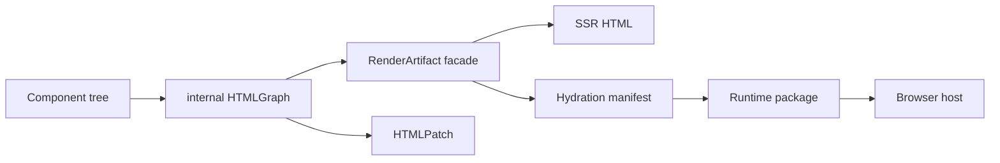
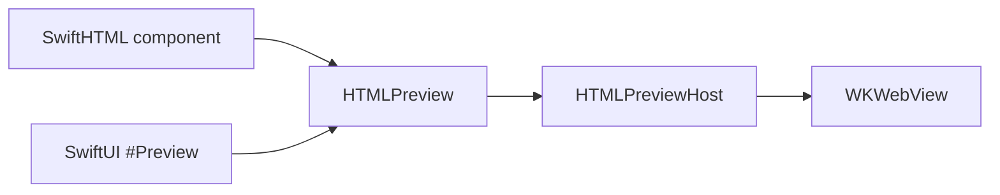

# SwiftHTML

SwiftHTML is a low-level declarative HTML engine for Swift applications.

It provides a typed HTML DSL, component model, renderer, internal graph diffing, typed CSS helpers, hydration metadata, client event bindings, split-loading contracts, and browser-neutral runtime contracts. It is deliberately framework-neutral: it does not depend on Vapor, JavaScriptKit, SwiftWebUI, server routing, or a concrete WebAssembly bootstrap.



## Status

SwiftHTML is an early pre-`1.0` package extracted from SwiftWeb. The public API is intended to be small and framework-neutral, but runtime and hydration contracts may still evolve before `1.0`.

This README describes the current `main` branch. Use the README from a matching Git tag when depending on a tagged release.

| Package | Role |
|---|---|
| `SwiftHTML` | HTML DSL, rendering, diffing, state, environment, CSS, hydration contracts, browser command contracts. |
| `SwiftHTMLPreview` | Xcode `#Preview` bridge, SwiftUI host view, and WebKit-backed HTML preview surface. |
| Higher-level server package | HTTP routing, request/response integration, security middleware, server action gateway. |
| Higher-level UI package | Design-system components, visual defaults, JavaScriptKit adapter, WASM bootstrap. |

## Requirements

SwiftHTML currently requires Swift 6.3 and Apple platform SDKs that provide `Synchronization.Mutex`.

| Platform | Minimum |
|---|---:|
| macOS | 15 |
| iOS | 18 |
| tvOS | 18 |
| watchOS | 11 |
| visionOS | 2 |

## Installation

Add SwiftHTML to a Swift Package. The examples in this README use the current `main` branch API:

```swift
// swift-tools-version: 6.3
import PackageDescription

let package = Package(
    dependencies: [
        .package(url: "https://github.com/1amageek/swift-html.git", branch: "main"),
    ],
    targets: [
        .target(
            name: "App",
            dependencies: [
                .product(name: "SwiftHTML", package: "swift-html"),
            ]
        ),
        .target(
            name: "AppPreviews",
            dependencies: [
                .product(name: "SwiftHTMLPreview", package: "swift-html"),
            ]
        ),
    ]
)
```

## Quick Start

```swift
import SwiftHTML

struct HomePage: Component {
    var body: some HTML {
        document {
            html {
                head {
                    meta(.charset("utf-8"))
                    title("SwiftHTML")
                }
                SwiftHTML.body {
                    main(.class("page")) {
                        h1("SwiftHTML")
                        p("Typed HTML rendered from Swift values.")
                        a(.href("/docs")) {
                            "Read the docs"
                        }
                    }
                }
            }
        }
    }
}

let html = HomePage().render()
print(html)
```

## Copyable Snippets

The snippets below are intentionally complete enough to paste into a Swift file. They include imports, model values, components, and the render or preview entry point. The examples use fenced Markdown code blocks so documentation surfaces can expose their normal copy action.

### Server-Rendered Page

```swift
import SwiftHTML

struct ArticleSummary: Sendable {
    let id: String
    let title: String
    let excerpt: String
    let href: String
}

struct ArticleListPage: Component, Sendable {
    let articles: [ArticleSummary]

    var body: some HTML {
        document {
            html {
                head {
                    meta(.charset("utf-8"))
                    title("Latest Articles")
                }
                SwiftHTML.body {
                    main(.class("article-list")) {
                        h1("Latest Articles")
                        p(.class("lead"), text: "Rendered on the server with typed SwiftHTML components.")

                        section(.aria("label", "Articles")) {
                            ForEach(articles, id: \.id) { summary in
                                articleCard(summary)
                            }
                        }
                    }
                    .style {
                        .maxWidth("720px")
                        .margin("0 auto")
                        .padding("32px")
                        .font("16px -apple-system, BlinkMacSystemFont, sans-serif")
                    }
                }
            }
        }
    }

    private func articleCard(_ summary: ArticleSummary) -> some HTML {
        article(.class("article-card")) {
            h2 {
                a(.href(summary.href)) {
                    summary.title
                }
            }
            p(summary.excerpt)
        }
        .style {
            .padding("16px 0")
            .border("0 solid color-mix(in srgb, CanvasText 16%, transparent)")
            .custom("border-bottom-width", "1px")
        }
    }
}

func renderArticleListPage() -> String {
    ArticleListPage(
        articles: [
            ArticleSummary(
                id: "swift-html",
                title: "Typed HTML in Swift",
                excerpt: "Use lowercase tags, typed attributes, and components to build HTML documents.",
                href: "/articles/swift-html"
            ),
            ArticleSummary(
                id: "hydration",
                title: "Hydration Contracts",
                excerpt: "Render artifacts carry state, event, and browser-neutral runtime metadata.",
                href: "/articles/hydration"
            ),
        ]
    )
    .render()
}
```

### Xcode Preview

```swift
import SwiftHTMLPreview

#Preview("Release Dashboard", traits: .fixedLayout(width: 520, height: 360)) {
    HTMLPreview {
        main(.class("dashboard-shell")) {
            header(.class("dashboard-header")) {
                p(.class("eyebrow"), text: "SwiftHTML Preview")
                h1("Release Operations")
                p("Inspect layout, copy, and CSS directly in Xcode.")
            }

            section(.class("metric-grid"), .aria("label", "Release metrics")) {
                article(.class("metric-card")) {
                    p(.class("metric-label"), text: "Tests")
                    strong("108")
                    span(.class("metric-trend"), text: "passing")
                }

                article(.class("metric-card")) {
                    p(.class("metric-label"), text: "Preview")
                    strong("Ready")
                    span(.class("metric-trend"), text: "WebKit")
                }
            }
        }
    }
    .style(
        """
        body {
          margin: 0;
          padding: 24px;
          font: 16px -apple-system, BlinkMacSystemFont, sans-serif;
          background: Canvas;
          color: CanvasText;
        }
        .dashboard-shell {
          display: grid;
          gap: 16px;
        }
        h1, p {
          margin: 0;
        }
        .dashboard-header {
          display: grid;
          gap: 8px;
        }
        .eyebrow, .metric-label, .metric-trend {
          color: color-mix(in srgb, CanvasText 68%, transparent);
        }
        .metric-grid {
          display: grid;
          grid-template-columns: repeat(2, minmax(0, 1fr));
          gap: 12px;
        }
        .metric-card {
          display: grid;
          gap: 6px;
          border: 1px solid color-mix(in srgb, CanvasText 16%, transparent);
          border-radius: 8px;
          padding: 12px;
        }
        """
    )
}
```

### Stateful Runtime Check

```swift
import SwiftHTML

struct InlineCounter: ClientComponent, Sendable {
    @State private var count = 0

    var body: some HTML {
        button(.type(ButtonType.button), .onClick {
            count += 1
        }) {
            "Count \(count)"
        }
    }
}

func renderCounterAfterOneClick() throws -> String {
    var runtime = try BrowserHydrationRuntime(
        root: InlineCounter(),
        host: BrowserDOMCommandBuffer(),
        stateStore: StateStore()
    )

    guard let handler = runtime.session.artifact.clientHandlers.handlers.first else {
        return runtime.session.artifact.html
    }

    let update = try runtime.invoke(handlerID: handler.id)
    return update.html
}
```

## Xcode Preview

Use `SwiftHTMLPreview` when you want to inspect SwiftHTML directly inside Xcode previews. Keep production targets depending on `SwiftHTML`, and add `SwiftHTMLPreview` only to preview or development-only targets.

| Product | Use |
|---|---|
| `SwiftHTML` | HTML DSL, render artifacts, CSS, state, hydration contracts. |
| `SwiftHTMLPreview` | `HTMLPreview`, SwiftUI preview host, WebKit-backed rendering. |



### Basic Preview

Import `SwiftHTMLPreview` and put `HTMLPreview` inside SwiftUI's `#Preview`:

```swift
import SwiftHTMLPreview

#Preview("Card") {
    HTMLPreview {
        article(.class("card")) {
            h2("SwiftHTML")
            p("Rendered in Xcode Preview.")
        }
    }
}
```

### Preview A Component

Any `Component` can be previewed without building a server:

```swift
import SwiftHTMLPreview

struct ProductCard: Component {
    let name: String

    var body: some HTML {
        article(.class("product-card")) {
            h2(name)
            p("Typed HTML rendered by SwiftHTML.")
        }
    }
}

#Preview("Product Card") {
    HTMLPreview {
        ProductCard(name: "Keyboard")
    }
}
```

### Fixed Size Previews

Use SwiftUI preview traits for fixed layouts:

```swift
import SwiftHTMLPreview

#Preview("Mobile", traits: .fixedLayout(width: 390, height: 844)) {
    HTMLPreview {
        main(.class("page")) {
            h1("Mobile Preview")
            p("This document is rendered inside a fixed preview surface.")
        }
    }
}
```

You can also use regular SwiftUI view modifiers around the preview host:

```swift
import SwiftHTMLPreview

#Preview("Fixed Host") {
    HTMLPreview {
        main {
            h1("Fixed Host")
        }
    }
    .frame(width: 390, height: 844)
}
```

### HTML-Specific Modifiers

Use short modifiers on `HTMLPreview` for document-level settings that SwiftUI Preview does not own.

| Modifier | Purpose |
|---|---|
| `.language(_:)` | Sets the document `<html lang="...">` value. |
| `.style(_:)` | Injects preview-only CSS into the generated document. |
| `.baseURL(_:)` | Resolves relative URLs inside the `WKWebView`. |
| `.renderOptions(_:)` | Controls SwiftHTML render diagnostics and runtime metadata. |

```swift
import SwiftHTMLPreview

#Preview("Japanese", traits: .fixedLayout(width: 390, height: 240)) {
    HTMLPreview {
        article(.class("card")) {
            h2("SwiftHTML")
            p("Xcode Preview で HTML を確認できます。")
        }
    }
    .style(
        """
        body {
          padding: 32px;
          font: 16px -apple-system, BlinkMacSystemFont, sans-serif;
        }
        .card {
          border: 1px solid color-mix(in srgb, CanvasText 16%, transparent);
          padding: 16px;
        }
        """
    )
    .language("ja")
}
```

### Build Behavior

`HTMLPreview` is a SwiftUI view. Put it inside `#Preview` so Xcode's preview discovery and build behavior stay exactly aligned with SwiftUI previews.

`SwiftHTMLPreview` is intentionally separate from `SwiftHTML` so the core HTML engine does not depend on SwiftUI, WebKit, or macro implementation details.

SwiftHTML escapes text and attribute values by default:

```swift
let rendered = div(.id("root")) {
    "5 > 3 & 2 < 4"
}
.render()
```

## Core Concepts

| Concept | API | Notes |
|---|---|---|
| HTML primitive | `div`, `span`, `input`, `text`, `rawHTML`, `Element` | Lowercase types map to DOM tags. |
| Component | `Component` | A value that returns `body`. |
| Server-owned component | `ServerComponent` | SSR/default ownership boundary. |
| Client-owned component | `ClientComponent` | Owns `@State`, event closures, and hydration metadata. |
| Render result | `RenderArtifact` | Public facade for HTML, diagnostics, manifests, handlers, and snapshots. |
| Runtime state | `StateStore` | Component-scoped state slots used during render and hydration. |
| Runtime state snapshot | `StateStoreSnapshot` | Codable state payload guarded by a state schema hash for HMR and WASM runtime swaps. |
| Runtime schema | `StateSchema` | Stable hash derived from state slots, value types, and source locations. |

SwiftHTML keeps the raw render graph internal. Public code should use `RenderArtifact`, `HTMLDOMSnapshot`, hydration indexes, diagnostics, and patch/runtime records instead of constructing graph nodes.

## HTML DSL

HTML tags are lowercase Swift types. Text can be written directly inside builders, or through text initializer shortcuts:

```swift
section(.id("intro")) {
    h2("Client Counter")
    p(.class("lead"), text: "State can belong to a ClientComponent.")
    input(
        .type(InputType.email),
        .name("email"),
        .placeholder("hello@example.com"),
        .required
    )
}
```

Attributes are typed where it matters and still allow escape hatches:

```swift
a(
    .href("/account"),
    .data("tracking-id", "account-link"),
    .aria("label", "Open account")
) {
    "Account"
}

Element("custom-element", attributes: [
    .attribute("part", "label")
]) {
    "Custom element content"
}
```

Builder control flow works with `if`, `switch`, `for`, and `ForEach`:

```swift
struct Menu: Component {
    let items: [String]
    let isSignedIn: Bool

    var body: some HTML {
        nav {
            ul {
                ForEach(items, id: \.self) { item in
                    li {
                        a(.href("/\(item)")) {
                            item
                        }
                    }
                }
            }

            if isSignedIn {
                button(.type(ButtonType.button)) {
                    "Sign out"
                }
            }
        }
    }
}
```

## Rendering

Use `render()` when only the HTML string is needed:

```swift
let html = HomePage().render()
```

Use `renderArtifact()` when a server or runtime needs diagnostics, hydration metadata, event handlers, or a DOM snapshot:

```swift
let artifact = HomePage().renderArtifact()

print(artifact.html)
print(artifact.diagnostics)
print(artifact.hydration.components)
print(artifact.browserHydrationIndex())
```

`HTMLRenderOptions` controls diagnostic capture, handler closure capture, browser hydration markers, and component environment overrides.

## CSS

Inline styles use `Style` and `@StyleBuilder`:

```swift
div {
    "Panel"
}
.style {
    .display("grid")
    .gridTemplateColumns("1fr auto")
    .gap("12px")
    .whiteSpace("nowrap")
    .custom("--panel-tone", "muted")
}
```

Stylesheets use `Stylesheet`, `CSSRule`, and `@StylesheetBuilder`:

```swift
let stylesheet = Stylesheet {
    rule(".panel") {
        .minHeight("36px")
        .background("var(--panel-background)")
        .borderRadius("8px")
    }

    rule(".panel[data-active=\"true\"]") {
        .outline("2px solid var(--accent)")
    }
}

print(stylesheet.cssText)
```

The generated CSS property surface is based on `@mdn/browser-compat-data`. Standard-track, non-deprecated, non-vendor properties are exposed as `Style` helpers so editors can autocomplete the CSS property surface.

`Style.custom(_:_:)`, dynamic CSS members, `CSSSelector`, `CSSRule`, and raw `style` attributes serialize values as authored. Do not pass untrusted external input directly into those APIs.

## State And Hydration

`ClientComponent` can own `@State` and event closures:

```swift
struct Counter: ClientComponent, Sendable {
    @State private var count = 0

    var body: some HTML {
        button(.type(ButtonType.button), .onClick {
            count += 1
        }) {
            "Count \(count)"
        }
    }
}
```

Rendering records state slots and event bindings in the artifact:

```swift
let store = StateStore()
let artifact = Counter().renderArtifact(stateStore: store)

let component = artifact.hydration.components.first
let handler = artifact.clientHandlers.handlers.first
```

State snapshots are explicit runtime data. A host can preserve client state during HMR or a component WASM swap only when the rendered state schema matches:

```swift
let schemaHash = artifact.hydration.stateSchemaHash
let snapshot = try store.snapshot(schemaHash: schemaHash)

let nextStore = StateStore()
nextStore.restore(snapshot)
```

Only values that can be encoded by the runtime are included in the snapshot. Non-encodable state falls back to the component initializer on restore.

The in-package hydration runtime can be used by tests or host adapters:

```swift
let host = BrowserDOMCommandBuffer()
var runtime = try BrowserHydrationRuntime(
    root: Counter(),
    host: host,
    stateStore: StateStore()
)

let handlerID = runtime.session.artifact.clientHandlers.handlers[0].id
let update = try runtime.invoke(handlerID: handlerID)

print(update.commands)
```

`HydrationRuntimeSession.flush()` tracks dirty components, then currently performs a whole-root re-render and graph diff. Scoped subtree diffing is a runtime optimization boundary, not part of the current correctness contract.

## Environment

Environment values can be defined with `EnvironmentKey`:

```swift
struct LocaleKey: EnvironmentKey {
    static let defaultValue = "en"
}

extension EnvironmentValues {
    var locale: String {
        get { self[LocaleKey.self] }
        set { self[LocaleKey.self] = newValue }
    }
}

struct LocaleLabel: Component {
    @Environment(\.locale) private var locale

    var body: some HTML {
        span {
            locale
        }
    }
}
```

Type-based environment reads are optional:

```swift
struct LibraryReader: Component {
    @Environment(Library.self) private var library: Library?

    var body: some HTML {
        if let library {
            span {
                library.title
            }
        } else {
            span {
                "Library unavailable"
            }
        }
    }
}
```

## Actions

SwiftHTML defines transport-neutral action contracts. It can render an action target and hidden fields, but it does not dispatch HTTP requests or invoke server actors.

```swift
struct SaveAction: ActionRepresentable {
    let path = "/actions/save"
    let method = FormMethod.post
    let fields = [
        ActionField("scope", "profile")
    ]
}
```

Higher-level packages can map `ActionRepresentable` to forms, buttons, fetch requests, server action gateways, or actor invocation.

## What SwiftHTML Does Not Own

| Concern | Expected owner |
|---|---|
| HTTP routing | Server framework package |
| Request and response objects | Server framework package |
| CSRF, CORS, Origin, Redirect policy | Server framework package |
| Server action dispatch | Server framework package |
| Distributed actor registry | Server framework package |
| Design-system components | UI package |
| JavaScriptKit DOM adapter | Runtime package |
| WASM bootstrap script | Runtime package |

## Safety Notes

| Surface | Behavior |
|---|---|
| Text nodes | Escaped by default. |
| Attribute values | Escaped and validated by attribute kind. |
| URL attributes | Reject unsafe JavaScript URLs in typed URL attributes. |
| `rawHTML` | Emits authored HTML; use only with trusted content. |
| CSS selectors and values | Serialized as authored; validate untrusted input before passing it to CSS APIs. |
| Event closures | Captured only in render artifacts for client-owned components and runtime adapters. |

## Development

```bash
swift build
xcodebuild test -scheme swift-html-Package -destination 'platform=macOS' -only-testing:SwiftHTMLTests
node scripts/generate-swift-html-css-properties.mjs --check
```

Refresh generated CSS helpers:

```bash
node scripts/generate-swift-html-css-properties.mjs
```

## Documentation

The DocC catalog lives in [Sources/SwiftHTML/SwiftHTML.docc](Sources/SwiftHTML/SwiftHTML.docc). Build it with:

```bash
xcodebuild docbuild -scheme swift-html-Package -destination 'generic/platform=macOS'
```

The longer design notes live in [docs/SwiftHTML.md](docs/SwiftHTML.md).

## License

SwiftHTML is available under the MIT license.
