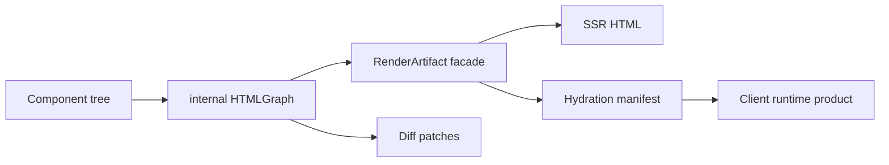

# SwiftHTML

SwiftHTML is a low-level declarative HTML engine for Swift applications.

It owns the HTML component model, rendering, diffing, hydration metadata, client event bindings, typed CSS helpers, and browser-neutral runtime contracts. It does not know about Vapor routes, pages, command-line workflows, SwiftWebUI visual components, JavaScriptKit, or concrete WebAssembly browser bootstrap code.

## Installation

SwiftHTML currently requires Swift 6.4 and Apple platform SDKs that provide `Synchronization.Mutex`:

| Platform | Minimum |
|---|---|
| macOS | 15 |
| iOS | 18 |
| tvOS | 18 |
| watchOS | 11 |
| visionOS | 2 |

```swift
// swift-tools-version: 6.4
import PackageDescription

let package = Package(
    dependencies: [
        .package(url: "https://github.com/1amageek/swift-html.git", from: "0.1.0"),
    ],
    targets: [
        .target(
            name: "App",
            dependencies: [
                .product(name: "SwiftHTML", package: "swift-html"),
            ]
        ),
    ]
)
```

## Example

```swift
import SwiftHTML

struct CounterPage: Component {
    var body: some HTML {
        main {
            h1("Counter")
            p("SwiftHTML renders typed HTML from Swift values.")
            button("Increment")
                .attribute(.type(.button))
        }
    }
}

let artifact = CounterPage().renderArtifact()
print(artifact.html)
```

## Responsibility

| Area | Responsibility |
|---|---|
| Component model | Defines `HTML`, `Component`, `ServerComponent`, and `ClientComponent`. |
| DSL builder | Provides `@HTMLBuilder`, conditionals, tuples, arrays, and `ForEach`. |
| HTML elements | Provides lowercase HTML tag structs, `Element`, and `HTMLAttribute`. |
| CSS model | Provides `Style`, generated standard CSS property helpers, `@StyleBuilder`, `Stylesheet`, `CSSRule`, and `@StylesheetBuilder`. |
| Rendering | Converts component trees to HTML strings and `RenderArtifact` facade values. |
| Diffing | Computes patch operations between old and new internal HTML graphs. |
| State | Provides `@State`, `Binding`, and state slot storage for client components. |
| Environment | Provides `@Environment`, `ContextKey`, visibility, and client-safe environment snapshots. |
| Actions | Defines `ActionRepresentable`, `Action`, and `ActionField` as transport-neutral render contracts. |
| Hydration | Exports browser hydration indexes and client handler manifests. |
| Loading | Defines split WASM loading manifests, plans, and load-order resolution used by runtime products. |
| Browser contracts | Provides DOM command encoding and browser host abstractions without binding to JavaScriptKit. |

## Boundary



SwiftHTML is deliberately framework-neutral. HTTP routing, server action dispatch, Vapor integration, design-system components, JavaScriptKit DOM application, and WASM bootstrap bridges belong in higher-level packages.

The raw render graph is an internal representation. Public code should consume `RenderArtifact` facade data, hydration indexes, DOM snapshots, diagnostics, and patch/runtime contracts instead of constructing graph nodes.

CSS selectors and values are serialized as authored. Do not pass untrusted external input directly into `Style.custom`, dynamic CSS properties, `CSSSelector`, `CSSRule`, or raw style attributes.

## Generated CSS Properties

`StyleProperties.generated.swift` is generated from `@mdn/browser-compat-data` CSS property metadata. The generated file is committed because it is part of SwiftHTML's public API surface.

```bash
node scripts/generate-swift-html-css-properties.mjs
node scripts/generate-swift-html-css-properties.mjs --check
```

## License

SwiftHTML is available under the MIT license.
