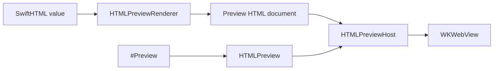

# ``SwiftHTMLPreview``

Render SwiftHTML values inside Xcode previews.

## Overview

SwiftHTMLPreview is the developer-time preview surface for SwiftHTML. Put ``HTMLPreview`` inside SwiftUI's `#Preview` to render SwiftHTML into a full HTML document displayed by a WebKit-backed SwiftUI view when WebKit is available.

SwiftHTMLPreview is separate from SwiftHTML so the core HTML engine remains framework-neutral.

`HTMLPreview` is a SwiftUI view, so Xcode preview discovery and build inclusion follow the same behavior as ordinary SwiftUI previews.



The preview snippet below is intentionally complete enough to copy into a preview-only Swift file:

```swift
import SwiftHTMLPreview

#Preview("Release Dashboard", traits: .fixedLayout(width: 520, height: 360)) {
    HTMLPreview {
        main(.class("dashboard-shell")) {
            header(.class("dashboard-header")) {
                p(.class("eyebrow"), text: "SwiftHTML Preview")
                h1("Release Operations")
                p("Inspect layout, copy, and CSS directly in Xcode.")
            }

            section(.class("metric-grid"), .aria("label", "Release metrics")) {
                article(.class("metric-card")) {
                    p(.class("metric-label"), text: "Tests")
                    strong("108")
                    span(.class("metric-trend"), text: "passing")
                }

                article(.class("metric-card")) {
                    p(.class("metric-label"), text: "Preview")
                    strong("Ready")
                    span(.class("metric-trend"), text: "WebKit")
                }
            }
        }
    }
    .style(
        """
        body {
          margin: 0;
          padding: 24px;
          font: 16px -apple-system, BlinkMacSystemFont, sans-serif;
        }
        .dashboard-shell {
          display: grid;
          gap: 16px;
        }
        h1, p {
          margin: 0;
        }
        .dashboard-header {
          display: grid;
          gap: 8px;
        }
        .eyebrow, .metric-label, .metric-trend {
          color: color-mix(in srgb, CanvasText 68%, transparent);
        }
        .metric-grid {
          display: grid;
          grid-template-columns: repeat(2, minmax(0, 1fr));
          gap: 12px;
        }
        .metric-card {
          display: grid;
          gap: 6px;
          border: 1px solid color-mix(in srgb, CanvasText 16%, transparent);
          border-radius: 8px;
          padding: 12px;
        }
        """
    )
}
```

Use preview traits exactly as you would with SwiftUI's `#Preview`. Use ``HTMLPreview/style(_:)``, ``HTMLPreview/language(_:)``, ``HTMLPreview/baseURL(_:)``, and ``HTMLPreview/renderOptions(_:)`` only for HTML-specific document settings:

```swift
#Preview("Mobile", traits: .fixedLayout(width: 390, height: 844)) {
    HTMLPreview {
        main(.class("page")) {
            h1("Mobile Preview")
            p("This SwiftHTML document is rendered inside Xcode Preview.")
        }
    }
    .language("ja")
}
```

## Topics

### Preview View

- ``HTMLPreview``

### Rendering

- ``HTMLPreviewHost``
- ``HTMLPreviewRenderer``
