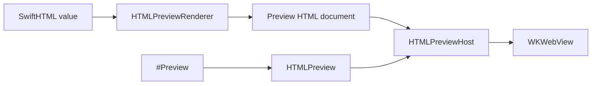

# ``SwiftHTMLPreview``

Render SwiftHTML values inside Xcode previews.

## Overview

SwiftHTMLPreview is the developer-time preview surface for SwiftHTML. Put ``HTMLPreview`` inside SwiftUI's `#Preview` to render SwiftHTML into a full HTML document displayed by a WebKit-backed SwiftUI view when WebKit is available.

SwiftHTMLPreview is separate from SwiftHTML so the core HTML engine remains framework-neutral.

`HTMLPreview` is a SwiftUI view, so Xcode preview discovery and build inclusion follow the same behavior as ordinary SwiftUI previews.



The preview snippet below is intentionally complete enough to copy into a preview-only Swift file:

```swift
import SwiftHTMLPreview

struct PreviewMetric: Sendable {
    let id: String
    let label: String
    let value: String
}

struct PreviewMetricsPanel: Component, Sendable {
    let title: String
    let metrics: [PreviewMetric]

    var body: some HTML {
        section(.class("metrics-panel")) {
            h2(title)
            div(.class("metrics-grid")) {
                ForEach(metrics, id: \.id) { metric in
                    article(.class("metric")) {
                        p(.class("metric-label"), text: metric.label)
                        strong(metric.value)
                    }
                }
            }
        }
    }
}

#Preview("Metrics Panel", traits: .fixedLayout(width: 430, height: 360)) {
    HTMLPreview {
        PreviewMetricsPanel(
            title: "Release Health",
            metrics: [
                PreviewMetric(id: "tests", label: "Tests", value: "108 passing"),
                PreviewMetric(id: "surface", label: "Surface", value: "HTML + CSS"),
                PreviewMetric(id: "preview", label: "Preview", value: "#Preview"),
                PreviewMetric(id: "runtime", label: "Runtime", value: "Hydration ready"),
            ]
        )
    }
    .style(
        """
        body {
          margin: 0;
          padding: 24px;
          font: 16px -apple-system, BlinkMacSystemFont, sans-serif;
        }
        .metrics-panel {
          display: grid;
          gap: 16px;
        }
        .metrics-grid {
          display: grid;
          grid-template-columns: repeat(2, minmax(0, 1fr));
          gap: 12px;
        }
        .metric {
          border: 1px solid color-mix(in srgb, CanvasText 16%, transparent);
          border-radius: 8px;
          padding: 12px;
        }
        .metric-label {
          margin: 0 0 6px;
          color: color-mix(in srgb, CanvasText 68%, transparent);
        }
        """
    )
}
```

Use preview traits exactly as you would with SwiftUI's `#Preview`. Use ``HTMLPreview/style(_:)``, ``HTMLPreview/language(_:)``, ``HTMLPreview/baseURL(_:)``, and ``HTMLPreview/renderOptions(_:)`` only for HTML-specific document settings:

```swift
#Preview("Mobile", traits: .fixedLayout(width: 390, height: 844)) {
    HTMLPreview {
        main(.class("page")) {
            h1("Mobile Preview")
            p("This SwiftHTML document is rendered inside Xcode Preview.")
        }
    }
    .language("ja")
}
```

## Topics

### Preview View

- ``HTMLPreview``

### Rendering

- ``HTMLPreviewHost``
- ``HTMLPreviewRenderer``
