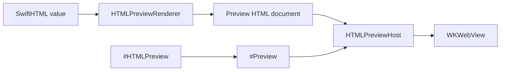

# ``SwiftHTMLPreview``

Render SwiftHTML values inside Xcode previews.

## Overview

SwiftHTMLPreview is the developer-time preview surface for SwiftHTML. It wraps SwiftUI's `#Preview`, renders SwiftHTML into a full HTML document, and displays that document in a WebKit-backed SwiftUI view when WebKit is available.

SwiftHTMLPreview is separate from SwiftHTML so the core HTML engine remains framework-neutral.

`#HTMLPreview` expands directly to SwiftUI's `#Preview`. It does not emit its own `#if DEBUG` guard; build inclusion follows the same Xcode preview behavior as `#Preview`.



The preview snippet below is intentionally complete enough to copy into a preview-only Swift file:

```swift
import SwiftHTMLPreview

struct PreviewMetric: Sendable {
    let id: String
    let label: String
    let value: String
}

struct PreviewMetricsPanel: Component, Sendable {
    let title: String
    let metrics: [PreviewMetric]

    var body: some HTML {
        section(.class("metrics-panel")) {
            h2(title)
            div(.class("metrics-grid")) {
                ForEach(metrics, id: \.id) { metric in
                    article(.class("metric")) {
                        p(.class("metric-label"), text: metric.label)
                        strong(metric.value)
                    }
                }
            }
        }
    }
}

#HTMLPreview(
    "Metrics Panel",
    traits: .fixedLayout(width: 430, height: 360),
    configuration: HTMLPreviewConfiguration(
        baseStyle: """
        body {
          margin: 0;
          padding: 24px;
          font: 16px -apple-system, BlinkMacSystemFont, sans-serif;
        }
        .metrics-panel {
          display: grid;
          gap: 16px;
        }
        .metrics-grid {
          display: grid;
          grid-template-columns: repeat(2, minmax(0, 1fr));
          gap: 12px;
        }
        .metric {
          border: 1px solid color-mix(in srgb, CanvasText 16%, transparent);
          border-radius: 8px;
          padding: 12px;
        }
        .metric-label {
          margin: 0 0 6px;
          color: color-mix(in srgb, CanvasText 68%, transparent);
        }
        """,
        viewport: .fixed(width: 430, height: 360)
    )
) {
    PreviewMetricsPanel(
        title: "Release Health",
        metrics: [
            PreviewMetric(id: "tests", label: "Tests", value: "108 passing"),
            PreviewMetric(id: "surface", label: "Surface", value: "HTML + CSS"),
            PreviewMetric(id: "preview", label: "Preview", value: "#HTMLPreview"),
            PreviewMetric(id: "runtime", label: "Runtime", value: "Hydration ready"),
        ]
    )
}
```

Use preview traits exactly as you would with SwiftUI's `#Preview`. Use ``HTMLPreviewConfiguration`` when the HTML document needs language, base CSS, base URL, render options, or a fixed WebKit viewport:

```swift
#HTMLPreview(
    "Mobile",
    traits: .fixedLayout(width: 390, height: 844),
    configuration: HTMLPreviewConfiguration(
        language: "ja",
        viewport: .fixed(width: 390, height: 844)
    )
) {
    main(.class("page")) {
        h1("Mobile Preview")
        p("This SwiftHTML document is rendered inside Xcode Preview.")
    }
}
```

## Topics

### Macro

- ``HTMLPreview(_:configuration:content:)``
- ``HTMLPreview(_:traits:_:configuration:content:)``

### Rendering

- ``HTMLPreviewHost``
- ``HTMLPreviewRenderer``
- ``HTMLPreviewConfiguration``
- ``HTMLPreviewViewport``
