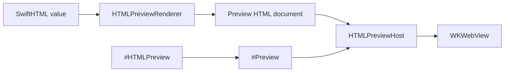

# ``SwiftHTMLPreview``

Render SwiftHTML values inside Xcode previews.

## Overview

SwiftHTMLPreview is the developer-time preview surface for SwiftHTML. It wraps SwiftUI's `#Preview`, renders SwiftHTML into a full HTML document, and displays that document in a WebKit-backed SwiftUI view when WebKit is available.

SwiftHTMLPreview is separate from SwiftHTML so the core HTML engine remains framework-neutral.

`#HTMLPreview` expands directly to SwiftUI's `#Preview`. It does not emit its own `#if DEBUG` guard; build inclusion follows the same Xcode preview behavior as `#Preview`.



```swift
import SwiftHTMLPreview

#HTMLPreview("Card") {
    article(.class("card")) {
        h2("SwiftHTML")
        p("Rendered in Xcode Preview.")
    }
}
```

Use preview traits exactly as you would with SwiftUI's `#Preview`:

```swift
#HTMLPreview("Mobile", traits: .fixedLayout(width: 390, height: 844)) {
    main {
        h1("Mobile preview")
    }
}
```

Use ``HTMLPreviewConfiguration`` for HTML-specific preview settings:

```swift
#HTMLPreview(
    "Japanese",
    configuration: HTMLPreviewConfiguration(language: "ja")
) {
    p("こんにちは")
}
```

## Topics

### Macro

- ``HTMLPreview(_:configuration:content:)``
- ``HTMLPreview(_:traits:_:configuration:content:)``

### Rendering

- ``HTMLPreviewHost``
- ``HTMLPreviewRenderer``
- ``HTMLPreviewConfiguration``
- ``HTMLPreviewViewport``
