# SwiftHTML Design

SwiftHTML is a framework-neutral declarative HTML engine. It defines a DOM DSL, component boundaries, render artifacts, and runtime contracts that higher-level packages can use to connect SSR, WebAssembly client actions, and server actions.

## Core Model

SwiftHTML has two different concepts that must not be collapsed:

| Concept | Naming | Responsibility |
|---|---|---|
| HTML primitive | lowercase | Standard HTML DOM tags and explicit primitives such as `div`, `label`, `input`, `button`, `text`, `rawHTML` |
| Component | UpperCamelCase | User-defined UI unit that can own state, environment reads, and event closures |

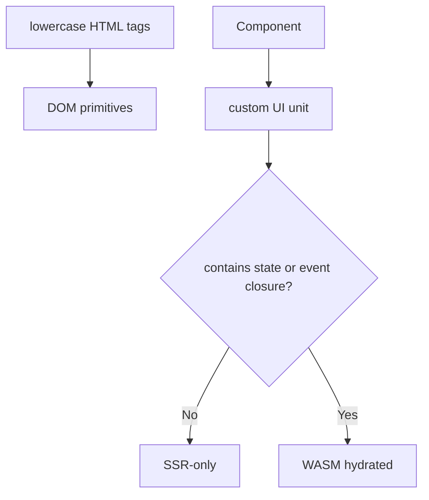

The lowercase HTML structs form the DOM tree. Components form the semantic and lifecycle boundary.

`HTML` itself is intentionally a marker protocol:

```swift
public protocol HTML {}
```

`HTML` is not the Sendable boundary. Component values may contain key paths, builders, and closures. The Sendable boundary is the rendered artifact facade, manifests, IDs, snapshots, and patch records.

## HTML Tags

HTML tags are defined as lowercase structs, matching the DOM names.

```swift
div(.id("profile"), .class("screen")) {
    label(.`for`("name")) {
        "Name"
    }

    input(
        .id("name"),
        .name("name"),
        .type(InputType.text)
    )
}
```

The tag layer stays thin. It does not own lifecycle, state, routing, dependency injection, or server behavior.

## HTML Graph

SwiftHTML should not store the render tree as a recursive public enum with arrays on every node. That shape is easy to understand but creates many allocations and makes traversal expensive.

The public DSL can be strongly typed, but the renderer should lower it into an arena-backed graph.

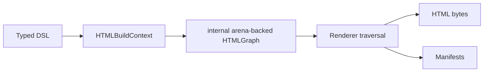

Avoid this shape as the core representation:

```swift
enum HTMLNode {
    case element(name: String, attributes: [HTMLAttribute], children: [HTMLNode])
    case text(String)
}
```

It creates repeated arrays, recursive value storage, repeated tag strings, and avoidable allocations.

The preferred internal shape is deliberately not public API:

```swift
public struct HTMLNodeID: Sendable, Hashable {
    public let rawValue: Int
}

struct HTMLGraph: Sendable {
    var nodes: [HTMLNodeRecord]
    var attributes: [HTMLAttributeRecord]
    var edges: [HTMLNodeID]
    var strings: [String]
}
```

```swift
struct HTMLNodeRecord: Sendable {
    var kind: HTMLNodeKind
    var firstAttribute: Int
    var attributeCount: Int
    var firstChild: Int
    var childCount: Int
    var flags: HTMLNodeFlags
    var fingerprint: NodeFingerprint
}
```

External code should never construct graph records directly. Public consumers use `RenderArtifact` facade values, hydration indexes, DOM snapshots, diagnostics, and patch/runtime contracts.

```swift
enum HTMLNodeKind: Sendable {
    case document
    case doctype
    case element(HTMLElementName)
    case text(HTMLStringID)
    case rawHTML(HTMLStringID)
    case fragment
    case component(ComponentID)
    case placeholder(PlaceholderID)
    case comment(HTMLStringID)
}
```

Attributes and children are stored in contiguous arenas and referenced by ranges from the node record.

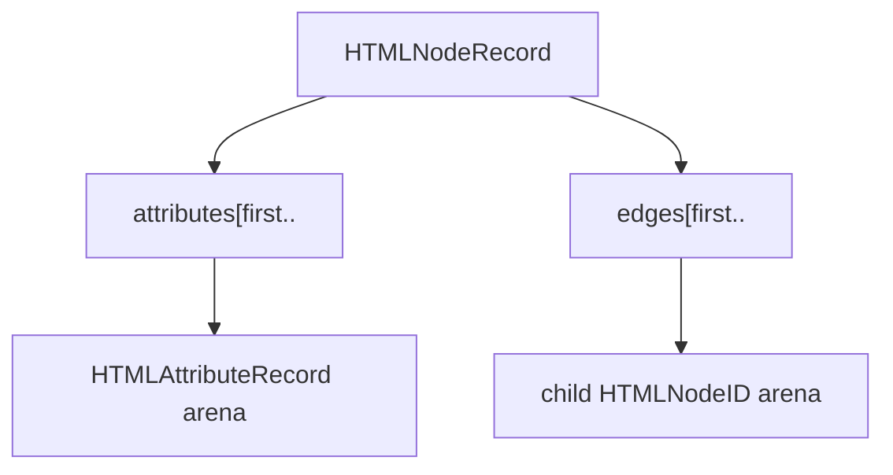

This representation gives the renderer a cache-friendly traversal:

| Requirement | Design |
|---|---|
| Low allocation | Shared node, attribute, edge, and string arenas |
| Fast traversal | Index-based records and contiguous ranges |
| Fast tag/attribute names | Interned or enum-backed names |
| Streaming | Subtrees can be flushed by node range |
| Manifest collection | Events, bindings, and components collected during traversal |
| Diffing | Fingerprints and stable identities live next to nodes |
| Concurrency | Graph becomes immutable after build |

`HTMLNodeID` is only a render-pass-local index. It is not a hydration identity.

## Attributes

Attributes are canonical as initializer arguments.

```swift
button(.type(.button), .class("primary")) {
    "Save"
}
```

Modifiers may exist as sugar for conditional composition, but the primary form is argument-based because attributes are part of the element declaration.

| Attribute form | Role |
|---|---|
| Initializer arguments | Canonical DOM declaration |
| Modifiers | Conditional or reusable post-processing sugar |

Attributes should be modeled as typed values rather than raw string pairs only.

```swift
public struct HTMLAttribute: Sendable {
    public let name: String
    public let value: String?
    public let kind: HTMLAttributeKind
}
```

This keeps normal attributes, boolean attributes, event bindings, and state bindings distinct.

## Attribute Coverage

SwiftHTML must cover the HTML Standard attribute model, not only common attributes such as `id`, `class`, and `style`.

The source of truth is the WHATWG HTML Standard attribute index. The implementation should be generated or audited against the standard instead of relying on a hand-written partial list.

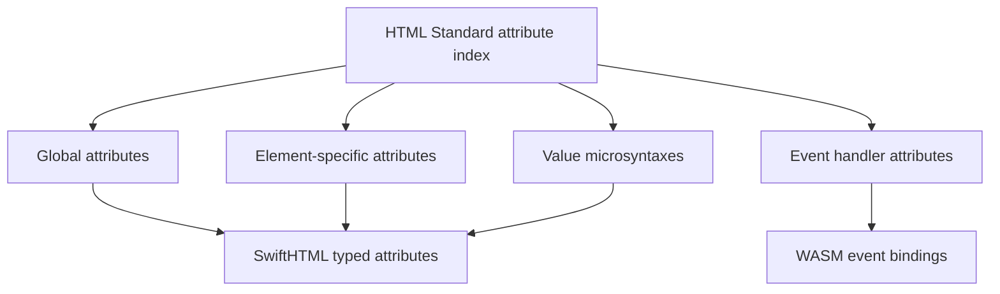

SwiftHTML needs all of these attribute categories:

| Category | Examples | SwiftHTML handling |
|---|---|---|
| Global attributes | `id`, `class`, `style`, `title`, `lang`, `dir`, `hidden`, `inert`, `tabindex`, `accesskey`, `contenteditable`, `draggable`, `spellcheck`, `translate`, `autofocus`, `popover`, `nonce` | Available on every lowercase HTML tag |
| Custom data | `data-*` | `data(_:_:)` and typed internal `data-swift-*` reservations |
| Accessibility | `role`, `aria-*` | Explicit `role(...)` and `aria(_:_:)`; ARIA values remain spec-driven |
| Shadow DOM / custom elements | `slot`, `part`, `exportparts`, `is` | Available as global attributes |
| Microdata | `itemscope`, `itemtype`, `itemid`, `itemprop`, `itemref` | Available as global attributes |
| URL/resource | `href`, `src`, `srcset`, `sizes`, `poster`, `cite`, `action`, `formaction`, `manifest`, `ping`, `download` | Typed URL/string attributes with escaping |
| Fetch/security | `crossorigin`, `integrity`, `referrerpolicy`, `fetchpriority`, `loading`, `decoding`, `sandbox`, `allow`, `allowfullscreen` | Enumerated or token-list attributes |
| Forms | `method`, `enctype`, `target`, `novalidate`, `accept-charset`, `autocomplete`, `rel` | Typed `form` attributes |
| Form controls | `name`, `value`, `type`, `checked`, `selected`, `disabled`, `readonly`, `required`, `multiple`, `placeholder`, `pattern`, `min`, `max`, `step`, `minlength`, `maxlength`, `size`, `list`, `accept`, `capture`, `dirname`, `form` | Typed control attributes and binding-aware property attributes |
| Tables | `colspan`, `rowspan`, `headers`, `scope`, `abbr`, `span` | Typed integer/token attributes |
| Media | `controls`, `autoplay`, `muted`, `loop`, `preload`, `playsinline`, `poster`, `width`, `height`, `kind`, `srclang`, `label`, `default` | Typed media attributes |
| Script/link/meta/style | `async`, `defer`, `nomodule`, `blocking`, `charset`, `type`, `rel`, `as`, `media`, `hreflang`, `content`, `http-equiv`, `color`, `disabled`, `nonce` | Typed head/resource attributes |
| Dialog/popover/command | `open`, `closedby`, `popover`, `popovertarget`, `popovertargetaction`, `command`, `commandfor` | Typed interactive-platform attributes |
| Geometry/canvas/embed | `width`, `height`, `coords`, `shape`, `usemap`, `data` | Typed element-specific attributes |
| International/input hints | `inputmode`, `enterkeyhint`, `autocapitalize`, `autocorrect`, `virtualkeyboardpolicy`, `writingsuggestions` | Enumerated attributes |
| Escape hatch | Any valid or future attribute | `attribute(_:_:)` remains available |

Event handler content attributes require special handling. SwiftHTML should expose event attributes such as `.onClick`, `.onInput`, and `.onSubmit`, but it must not emit inline JavaScript handler strings. Event attributes lower to WASM handler bindings and client manifests.

```swift
button(.onClick {
    count += 1
}) {
    "+"
}
```

The generated HTML contains a framework-owned dispatch attribute, not `onclick`.

```html
<button data-swift-event-click="handler-id">+</button>
```

`DOMEvent` is the runtime payload shape passed from the browser/WASM dispatcher into Swift closures. It carries common form, keyboard, pointer, and metadata values while keeping the HTML output free of inline JavaScript.

### Attribute Value Kinds

The attribute representation must preserve the value kind because rendering, validation, binding, and code generation differ by kind.

| Value kind | Examples | Notes |
|---|---|---|
| Boolean | `disabled`, `checked`, `selected`, `required`, `autofocus`, `itemscope` | Render as present/absent |
| Enumerated | `dir`, `draggable`, `contenteditable`, `method`, `target`, `preload`, `crossorigin` | Model with Swift enums where practical |
| Text | `title`, `alt`, `placeholder`, `label` | Escape by default |
| Token list | `class`, `rel`, `sandbox`, `blocking`, `headers` | Preserve token boundaries |
| Ordered token list | `accesskey` | Preserve order |
| ID reference | `for`, `list`, `form`, `popovertarget`, `commandfor` | Should be distinct from arbitrary text |
| ID reference list | `aria-describedby`, `itemref`, `headers` | Preserve references |
| URL | `href`, `src`, `action`, `cite`, `poster` | Escape and optionally validate |
| URL list / responsive source | `srcset`, `imagesrcset`, `sizes` | Needs dedicated representation |
| Number | `width`, `height`, `rows`, `cols`, `span`, `tabindex` | Integer or floating point depending on attribute |
| Date/time strings | `datetime`, date/time input values | Preserve HTML microsyntax |
| Media query | `media` | Keep as CSS media query string or typed wrapper |
| MIME/token hints | `accept`, `type`, `as` | Typed wrappers where useful |
| CSS declarations | `style` | Prefer structured `Style` helpers; raw string allowed as an escape hatch |
| CSP nonce | `nonce` | Can be fed from `@Environment(\.cspNonce)` |
| Property binding | `value($name)`, `checked($isOn)` | Hydration/runtime binding, not only serialized HTML |
| Event binding | `onClick {}` | WASM handler binding |

`textarea(.value($text))` is a property binding. SSR renders the current value as escaped text content rather than as a `value` attribute, while the graph still records the property binding for hydration.

`srcdoc` has two deliberate modes: `srcdoc(String)` treats the value as text content inside the frame, while `srcdoc(rawHTML(...))` treats it as explicit markup and escapes only for attribute serialization.

### CSS Model

SwiftHTML represents CSS as data before serialization.

| Layer | Type | Purpose |
|---|---|---|
| Inline declarations | `Style` | Render `style` attributes and reusable declaration lists |
| Standard properties | Generated `Style` helpers | Autocomplete standard, non-deprecated, non-vendor CSS property names |
| Stylesheet rules | `Stylesheet` / `CSSRule` | Render selector blocks for `style` tags or generated assets |
| Builders | `@StyleBuilder` / `@StylesheetBuilder` | Compose declarations and rules with `if`, `switch`, and loops |

| Surface | Status | Notes |
|---|---|---|
| `Style` | Public | User-facing inline declaration list and rule body |
| `CSSRule` | Public | Selector plus `Style` for stylesheet output |
| `Stylesheet` | Public | Collection of stylesheet rules |
| Declaration storage | Internal | Low-level property/value records used by `Style` serialization |

Raw CSS strings remain an escape hatch for browser-specific features, but framework-owned CSS should use the typed model so theme output, tests, and future optimization can reason about declarations. Selectors and declaration values are serialized as authored; do not pass untrusted external input directly into `Style.custom`, dynamic CSS properties, `CSSSelector`, `CSSRule`, or raw `style` attributes.

The standard property surface is generated from MDN browser compatibility data. SwiftHTML includes standard-track, non-deprecated, non-vendor CSS properties as static `Style` helpers. The generated helpers preserve Swift naming while rendering canonical CSS property names.

`StyleProperties.generated.swift` is refreshed by `scripts/generate-swift-html-css-properties.mjs`. The generator downloads `@mdn/browser-compat-data`, reads `css.properties`, excludes vendor-prefixed properties, and emits deterministic Swift helpers. Use `--check` in validation workflows when CSS metadata is updated.

| CSS property | Swift helper | Rendered declaration |
|---|---|---|
| `z-index` | `.zIndex("10")` | `z-index: 10` |
| `white-space` | `.whiteSpace("nowrap")` | `white-space: nowrap` |
| `inset-inline-start` | `.insetInlineStart("2rem")` | `inset-inline-start: 2rem` |
| `animation-timeline` | `.animationTimeline("view()")` | `animation-timeline: view()` |
| `container-type` | `.containerType("inline-size")` | `container-type: inline-size` |

Use `Style.custom(_:_:)` for CSS custom properties, vendor-prefixed properties, experiments, and newly standardized properties before the generated helper list is refreshed.

The canonical stylesheet rule form is builder-based because CSS rules often need conditional declarations and theme-dependent composition. Rule builders use the same declaration syntax as inline `.style { ... }`.

```swift
Stylesheet {
    rule(".panel") {
        .minHeight("36px")
        .width("100%")
    }
}
```

### Coverage Strategy

SwiftHTML should have a two-level API:

| Level | Responsibility |
|---|---|
| Typed enum overloads | Common enumerated values such as `InputMode.search`, `EnterKeyHint.send`, `CrossOrigin.anonymous`, `ReferrerPolicy.strictOriginWhenCrossOrigin`, `FetchPriority.high`, and `Preload.metadata` |
| String overloads | Escape hatch for new standard values, custom elements, and values not yet modeled |

| Layer | Purpose |
|---|---|
| Typed attributes | Common, global, and element-specific attributes with Swift value types |
| Raw escape hatch | Future attributes, experimental platform attributes, and custom integrations |

The first implementation does not need perfect compile-time validation that `href` only appears on elements that accept `href`. It does need the internal model to retain enough information to add that validation later.

```swift
div(.id("root"), .data("scope", "profile")) {
    a(.href("/events"), .rel(.noopener)) {
        "Events"
    }

    input(
        .type(.email),
        .name("email"),
        .autocomplete(.email),
        .required,
        .value($email),
        .onInput { event in
            email = event.value
        }
    )
}
```

Reserved framework attributes such as `data-swift-*` should be generated internally and should not be the normal user-facing API.

## Components

`Component` is the declarative View unit. It is not automatically a hydration boundary.

```swift
public protocol Component: HTML {
    associatedtype Body: HTML

    @HTMLBuilder
    var body: Body { get }
}
```

Execution ownership is expressed with marker protocols.

```swift
public protocol ServerComponent: Component {}

public protocol ClientComponent: Component {}
```

| Protocol | Responsibility | Hydration |
|---|---|---|
| `Component` | View declaration | Inherits current ownership |
| `ServerComponent` | Server-owned View | No hydration boundary |
| `ClientComponent` | Client-owned View | Creates hydration boundary |

Ownership can nest. A `ClientComponent` makes ordinary nested `Component` values client-owned. An explicit `ServerComponent` resets ownership inside that subtree, and nested `ClientComponent` values can start new client boundaries.

This classification is component-based, not file-based. SwiftWeb should not require Next.js-style file separation such as `use client` or `use server`.

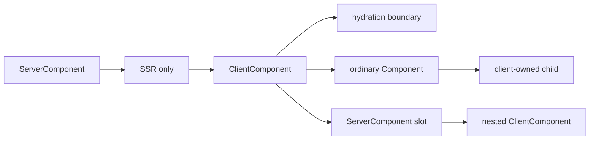

## Tuple Component

`@HTMLBuilder` must keep the static shape of multiple child elements. A multi-child builder result is represented by `TupleComponent`, the SwiftHTML equivalent of SwiftUI's `TupleView`.

```swift
public struct TupleComponent<each Content: HTML>: HTML
```

```swift
div {
    h1("Title")
    p("Body")
}
```

Use the closure form when the element contains mixed HTML children.

```swift
p {
    "Read the "
    strong("guide")
    " before continuing."
}
```

The builder output for the `div` children is:

```text
TupleComponent<h1, p>
```

`TupleComponent` exists for typed composition. It is not a compatibility wrapper and it is not a public recursive node tree. During rendering it lowers to a fragment node in `HTMLGraph`.

| Builder input | Builder output |
|---|---|
| No child | `EmptyHTML` |
| One child | The child type itself |
| Multiple children | `TupleComponent<each Content>` |
| Optional branch | `OptionalComponent<Content>` |
| `if` / `switch` branch | `ConditionalComponent<TrueContent, FalseContent>` |
| `for` output | `ArrayComponent<Content>` |
| Keyed dynamic list | `ForEach<Data, ID, Content>` |

## Builder Control Flow

SwiftHTML must support SwiftUI-like control flow inside `@HTMLBuilder`.

| Construct | Requirement | Identity behavior |
|---|---|---|
| `if` | Required | Optional subtree |
| `if else` | Required | Conditional branch subtree |
| `switch` | Required | Conditional branch subtree |
| `for` | Required | Position-based children |
| `ForEach` | Required | Keyed children |
| `if #available` | Supported through limited availability builder hook | Conditional subtree |
| optional HTML | Required | Optional subtree |

The builder should model control flow explicitly instead of flattening every branch into anonymous fragments too early.

```swift
public struct OptionalComponent<Content: HTML>: HTML

public enum ConditionalComponent<TrueContent: HTML, FalseContent: HTML>: HTML

public struct ArrayComponent<Content: HTML>: HTML
```

`switch` is represented through nested conditional builder output.

```swift
switch status {
case .loading:
    p("Loading")
case .ready:
    ContentView()
case .failed:
    ErrorView()
}
```

`for` loops are supported for simple output, but they are position-based. Dynamic lists that can insert, delete, reorder, or contain stateful components should use `ForEach`.

## ForEach

`ForEach` is a required primitive because it provides keyed identity for diffing and state preservation.

```swift
ForEach(events, id: \.id) { event in
    EventRow(event: event)
}
```

`ForEach` is not just syntax sugar for `for`. It writes `Key` information into the graph so the diff algorithm can match children across renders.

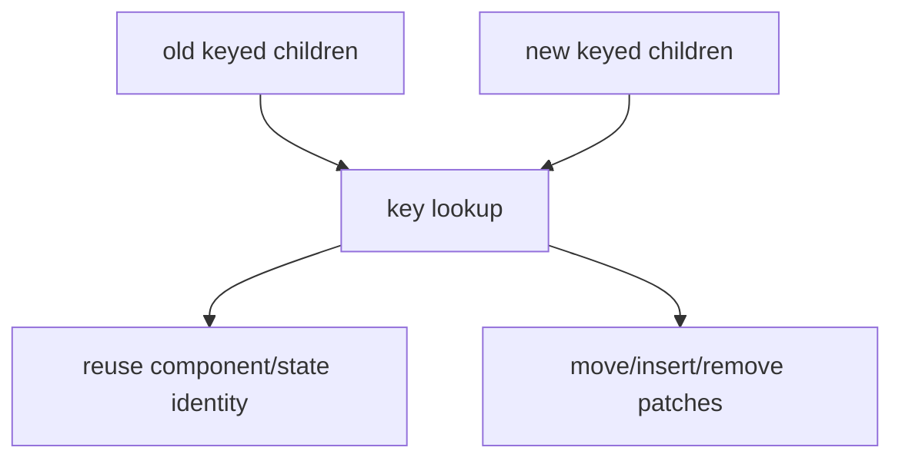

Required API forms:

```swift
public struct ForEach<Data, ID: Hashable & Sendable, Content: HTML>: HTML
where Data: RandomAccessCollection {
    public init(
        _ data: Data,
        id: KeyPath<Data.Element, ID>,
        @HTMLBuilder _ content: @escaping (Data.Element) -> Content
    )
}
```

```swift
public extension ForEach where Data.Element: Identifiable, ID == Data.Element.ID {
    init(
        _ data: Data,
        @HTMLBuilder _ content: @escaping (Data.Element) -> Content
    )
}
```

`ForEach` lowering:

```text
ForEach
  child key: event-1 -> EventRow
  child key: event-2 -> EventRow
  child key: event-3 -> EventRow
```

Diff behavior:

| Old/new keyed child | Patch behavior |
|---|---|
| Same key, same fingerprint | Skip subtree |
| Same key, different fingerprint | Diff subtree |
| New key | Insert node/subtree |
| Missing key | Remove node/subtree |
| Same keys, different order | Move existing nodes |

Guidance:

| Use | When |
|---|---|
| `for` | Static or position-stable output without state |
| `ForEach` | Dynamic lists, reordered lists, inserted/deleted rows, stateful rows |

`ForEach` keys must be unique and stable across renders. Duplicate keys are reported as `swift-html.identity.duplicate-key-in-for-each` because they make diffing, hydration, and `@State` ownership ambiguous. Keys should not be derived from the current list index unless position identity is explicitly intended.

## State

`@State` belongs to component instances. It does not belong to lowercase HTML primitives.

`@State` is part of SwiftHTML, not SwiftWebUI. SwiftWebUI can provide visual components, but state ownership belongs to `Component` instances in the HTML runtime.

```swift
struct Counter: Component {
    @State private var count = 0

    var body: some HTML {
        button(.onClick {
            count += 1
        }) {
            "+"
        }

        span {
            count
        }
    }
}
```

The renderer assigns stable component identity and state slot identity during graph construction.

| Requirement | Reason |
|---|---|
| Stable component identity | Match SSR output to WASM component instance |
| Stable state identity | Preserve `@State` across updates |
| `key` support | Keep state correct in lists and reordered collections |
| Hydration boundary | Know which subtree belongs to which component |

State values are stored in `StateStore`. A render can receive an existing store so state survives across component rebuilds.

```swift
let store = StateStore()
let first = Counter().renderArtifact(stateStore: store)
first.clientHandlers.handlers[0].invoke()
let second = Counter().renderArtifact(stateStore: store)
```

State mutation marks the owning `ComponentID` dirty. The WASM runtime will use that dirty component set to rebuild and patch the smallest component boundary.

### Observable Models

SwiftHTML follows SwiftUI Observation style from [Apple's migration guidance](https://developer.apple.com/documentation/SwiftUI/Migrating-from-the-observable-object-protocol-to-the-observable-macro): use `@Observable` for reference models read by component bodies. Values stored in `@State` and `EnvironmentValues` are `Sendable`, so use a `Sendable` root owner when the observable model itself is a mutable reference type.


```swift
import Foundation
import Observation
import Synchronization
import SwiftHTML

@Observable
final class Book: Identifiable {
    let id = UUID()
    var title: String

    init(title: String) {
        self.title = title
    }
}

final class Library: Sendable {
    private let storage: Mutex<[Book]>

    init(books: sending [Book] = [
        Book(title: "Initial Title"),
    ]) {
        self.storage = Mutex(books)
    }

    var books: [Book] {
        storage.withLock { books in
            books
        }
    }

    func updateTitle(id: UUID, to title: String) {
        storage.withLock { books in
            guard let index = books.firstIndex(where: { book in book.id == id }) else {
                return
            }
            books[index].title = title
        }
    }
}
```

```swift
struct LibraryPage: Component {
    @State private var library = Library()

    var body: some HTML {
        LibraryView()
            .environment(library)
    }
}
```

```swift
struct LibraryView: Component {
    @Environment(Library.self) private var library: Library?

    var body: some HTML {
        ul {
            if let library {
                ForEach(library.books) { book in
                    BookRow(book: book)
                    BookEditor(book: book, library: library)
                }
            }
        }
    }
}
```

```swift
struct BookRow: Component {
    let book: Book

    var body: some HTML {
        li {
            book.title
        }
    }
}
```

Event closures are render-resident handlers, not serialized HTML and not a cross-concurrency data contract. Capture the root owner and stable IDs, then perform mutation through the owner.

```swift
struct BookEditor: Component {
    let book: Book
    let library: Library

    var body: some HTML {
        let bookID = book.id

        input(
            .type(InputType.text),
            .value(book.title),
            .onInput { event in
                library.updateTitle(id: bookID, to: event.value ?? "")
            }
        )
    }
}
```

| Model role | SwiftHTML API |
|---|---|
| Observable child model | `@Observable final class Book` |
| Root owner | `final class Library: Sendable` |
| State ownership | `@State private var library = Library()` |
| Scoped lookup | `.environment(library)` and optional `@Environment(Library.self)` |
| Event mutation | Capture `Library` plus stable IDs, then call owner methods |

SwiftHTML wraps component rendering in `Observation.withObservationTracking`. When an observable property that was read while building `body` changes, the owning component is marked dirty. Hydration can then rerender and patch that component boundary.

### Environment And Context

SwiftHTML uses SwiftUI-style Environment as the only scoped value propagation mechanism. Values are written with `.environment(...)` and read with `@Environment(...)`.

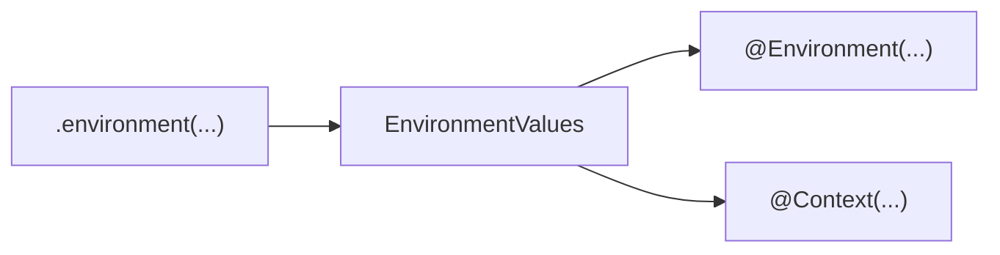

`ContextKey` is a domain-oriented key that uses the same `EnvironmentValues` storage. It exists only to give app context a clearer read-side name. It is not a second provider system, and there is no `.context(...)` provider modifier.

Prefer `@Environment` when SwiftUI parity matters or when the value is a framework/platform concern. Use `@Context` only when a domain value benefits from a React Context-like read-side name while still being provided through `.environment(...)`.

```swift
struct AuthContext: ContextKey {
    static let defaultValue = AuthSession.guest
}
```

```swift
struct UserMenu: Component {
    @Context(AuthContext.self) private var auth: AuthSession

    var body: some HTML {
        span {
            auth.role
        }
    }
}
```

```swift
Dashboard()
    .environment(AuthContext.self, session)
```

Use `Group` when multiple sibling components need the same scoped value and no extra DOM element should be emitted.

```swift
Group {
    UserMenu()
    AccountLinks()
}
    .environment(AuthContext.self, session)
```

Use `@Environment` for platform/framework values such as theme, locale, layout direction, route metadata, nonce, and request-derived values. Use `@Context` sparingly for app/domain context that would otherwise be named as a React context. Both flow through the same scoped environment mechanism.

`@Context` reads scoped values. It is not local state. `@State` is owned by the component instance and should not be used to pass global values down the tree.

### Server Capabilities

`@Server` is the server-only capability channel. It is separate from `@Environment` because it can expose resources that must never be serialized into a client snapshot.

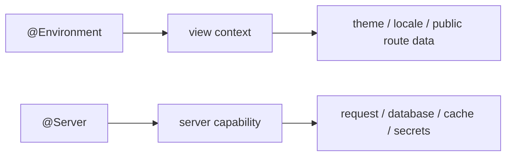

| API | Responsibility | ClientComponent availability |
|---|---|---|
| `@Environment` | View context | Only client-snapshot keys |
| `@Context` | Domain view context | Only client-snapshot keys |
| `@Server` | Server runtime capability | Never |
| props | Explicit data input | Only if the value is client-safe |

```swift
struct ProfilePage: ServerComponent {
    @Server(\.request) private var request

    var body: some HTML {
        ProfilePanel()
            .environment(\.locale, request.locale)
    }
}
```

`@Server` is valid in server-owned execution such as `ServerComponent`, page `load`, route handlers, and server actions. `ClientComponent` must not read `@Server`; server work should be exposed through public props, client-safe environment snapshots, or explicit server actions.

`@Server` reads participate in hydration diagnostics. SwiftWeb records reads such as `@Server(\.request)` during rendering; if the read happens inside a client-owned subtree, the renderer reports `swift-html.hydration.server-capability-in-client-component`.

Environment keys are server-only by default. A key must opt in to client snapshotting.

```swift
public protocol EnvironmentKey {
    associatedtype Value: Sendable
}

public enum EnvironmentVisibility: Sendable {
    case serverOnly
    case clientSnapshot
    case runtimeOnly
}

public protocol ClientEnvironmentKey: EnvironmentKey
where Value: Codable & Sendable {}
```

| Environment value | Default visibility | Client behavior |
|---|---|---|
| `EnvironmentKey` | `serverOnly` | Diagnostic if read by client-owned component |
| `ClientEnvironmentKey` | `clientSnapshot` | Encoded into hydration environment snapshot |
| Direct type environment | `runtimeOnly` | Runtime-local, not serialized |

## Identity And Diffing

SwiftHTML should support SwiftUI-like differential updates for hydrated components. The design is based on stable identity and subtree fingerprints, not on making every node directly `Hashable`.

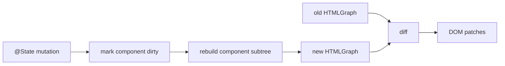

### Identity Types

Different IDs have different lifetimes and must not be conflated.

| Identity | Lifetime | Purpose |
|---|---|---|
| `HTMLNodeID` | One render pass | Fast arena index into `HTMLGraph` |
| `ComponentID` | Stable across hydration/update | Preserve component instance and state |
| `StateSlotID` | Stable inside a component | Preserve `@State` value |
| `HandlerID` | Stable while handler is valid | Connect DOM event to WASM handler |
| `Key` | Stable across list reorder | Preserve child identity in dynamic collections |
| `NodeFingerprint` | One rendered graph version | Fast subtree equality check |

`HTMLNodeID` is intentionally ephemeral. It is an index into the current arena-backed graph and can change on every render.

`ComponentID`, `StateSlotID`, `HandlerID`, and `Key` are semantic identities used by hydration and update logic.

### Keys

Lists and dynamic collections require explicit keys.

```swift
ForEach(events, id: \.id) { event in
    EventRow(event: event)
}
```

`Key` is `Hashable & Sendable`.

```swift
public struct Key: Hashable, Sendable {
    public let rawValue: String
}
```

`ForEach` contributes key segments to component paths. Stateful components inside a keyed list keep their `ComponentID` and `StateSlotID` when the list is reordered.

The key is used for lookup. It must preserve stable semantic identity across renders.

### Fingerprints

Each node record should carry or be able to compute a subtree fingerprint.

```swift
public struct NodeFingerprint: Hashable, Sendable {
    public let rawValue: UInt64
}
```

Fingerprints are an optimization:

| Fingerprint result | Diff behavior |
|---|---|
| Different | Inspect or patch subtree |
| Same | Skip subtree in release builds |
| Same in debug validation mode | Optionally verify structural equality to detect collisions |

Fingerprints must include the rendered semantics of the subtree:

| Included | Examples |
|---|---|
| Node kind | element, text, fragment, component boundary |
| Element name | `div`, `input`, `button` |
| Rendered attributes | normal attributes and boolean attributes |
| DOM properties | bound `value`, `checked`, `selected` initial state |
| Event bindings | handler identity, event name, event options |
| Child order | sequence of child fingerprints |
| Keys | keyed child identity |

Fingerprints must not include ephemeral arena indices such as `HTMLNodeID`.

### Dirty Components

State changes should mark the owning component dirty. Rebuilding should be scoped to the smallest component boundary that owns the state.

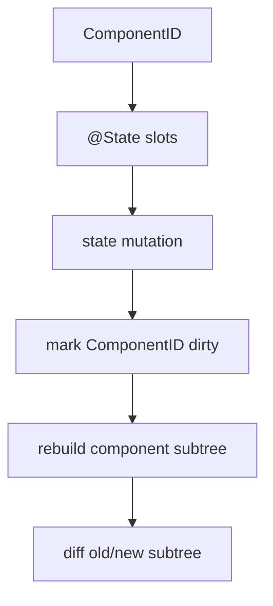

This avoids rebuilding the entire page for local UI changes.

### Patch Model

Diffing produces a small patch list for the browser runtime.

| Patch | Purpose |
|---|---|
| `updateText` | Update text node content |
| `updateComment` | Update comment or placeholder comment content |
| `updateAttributes` | Replace the rendered attribute set for an element |
| `setProperty` | Update DOM properties such as `value`, `checked`, `selected` |
| `insertSubtree` | Insert a rendered subtree from the new graph |
| `remove` | Remove existing node by parent and index |
| `moveKeyed` | Reorder keyed children without relying on stale old indexes |
| `replaceSubtree` | Replace structurally incompatible subtree with rendered HTML |

The patch model must distinguish attributes from DOM properties. Form controls cannot rely on attributes alone after hydration.

### Diff Rules

The diff algorithm should follow these rules:

| Case | Action |
|---|---|
| Different component type or `ComponentID` | Replace component subtree |
| Same component and same fingerprint | Skip subtree |
| Same element name | Diff attributes, properties, event bindings, and children |
| Different element name | Replace subtree |
| Text node changed | Emit `setText` |
| Unkeyed children | Diff by position |
| Keyed children | Match by `Key`, then move/insert/remove |
| Event binding changed | Emit `updateEventBinding` |
| Property binding changed | Emit `setProperty` |

### Server And Client Diffing

Diffing is primarily a client/WASM concern for hydrated components.

| Context | Behavior |
|---|---|
| SSR first render | Build full graph and emit full HTML |
| Hydration | Associate DOM with component IDs, state slots, and handlers |
| Client state update | Rebuild dirty component subtree and patch DOM |
| Server action returns HTML | Replace target subtree and mount returned manifest |
| Streaming SSR | Append/replace streamed chunks and apply manifest updates |

SwiftWeb server rendering may use fingerprints for cache validation or streaming optimization, but DOM patch execution belongs to the client runtime.

## Events

Event attributes should accept direct closures at the user API layer.

```swift
button(.onClick {
    count += 1
}) {
    "+"
}
```

The closure is a client closure. It is lowered to a WebAssembly handler, not serialized into HTML and not emitted as JavaScript source.

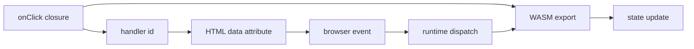

The generated HTML carries handler identity only.

```html
<button data-swift-event-click="handler-id">+</button>
```

The browser runtime dispatches the DOM event to the WASM handler. SwiftHTML and SwiftWeb do not inject JavaScript as a fallback; if a host cannot provide the WASM dispatch bridge, the page must remain progressively usable through server routes and forms.

## Client And Server Boundary

SwiftWeb keeps the client/server split, but the boundary is expressed by APIs rather than file layout.

| Work | Execution place | API |
|---|---|---|
| DOM event and local UI state | Client WASM | `.onClick {}`, `.onInput {}`, `@State` |
| Database mutation | Server | Server Action or `@Server` service |
| Route-local mutation | Server | Route Action |
| Form submission | Server with progressive enhancement | `form(.action(...))` |
| Lightweight validation/filtering | Client WASM | Client closure or Client Action |

Client closures must not depend on Vapor `Request`, database handles, private secrets, or `@Server` capabilities. Server work is represented by an action reference.

## Server Actions And Resolvable Services

Server Action represents explicit intent to mutate server-side state or call a server-side service. In SwiftWeb this boundary should be modeled as a typed Distributed Actor method invocation rather than a hand-written web API handler.

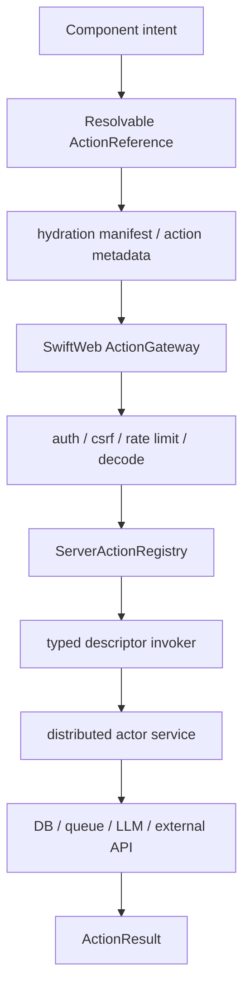

The canonical source declaration is a `distributed func` annotated with `@ServerAction`.

```swift
distributed actor ChatSession {
    private var messages: [ChatMessage] = []

    @ServerAction
    distributed func send(
        _ input: ChatInput,
        context: ActionInvocationContext
    ) async throws -> ActionResult {
        messages.append(.user(input.text))
        let reply = try await model.respond(to: messages)
        messages.append(.assistant(reply))
        return .patch(ChatPatch(reply: reply))
    }
}
```

The generated action reference must be `Resolvable` so Client WASM can resolve the server method through the runtime instead of knowing Vapor routing details.

```swift
public protocol Resolvable: Sendable, Codable {
    associatedtype Resolved: Sendable

    func resolve(using resolver: any ActionReferenceResolving) async throws -> Resolved
}
```

The resolver boundary keeps SwiftHTML framework-neutral. SwiftHTML can carry the `ActionReference`, while SwiftWeb supplies the concrete resolver and HTTP gateway.

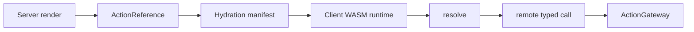

| Concern | Owner |
|---|---|
| `@ServerAction` signature validation | SwiftWebMacros |
| Resolvable action handle in render artifacts | SwiftHTML |
| Gateway, middleware, and transport | SwiftWeb |
| Actor registry and distributed invocation support | SwiftWeb `WebActorSystem` backed by ActorRuntime |
| Typed method invocation | Generated `ServerActionDescriptor` registered in `ServerActionRegistry` |
| Visual declaration of the intent | SwiftWebUI `Button` / `Form` |

The HTTP gateway must not synthesize compiler-internal distributed target names from request metadata. `@ServerAction` generates a descriptor with a typed invoker; `@Page` registers page-owned distributed actor services when their actor system is `WebActorSystem`.

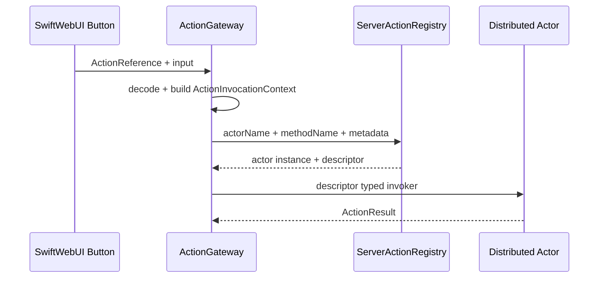

`Button(action: service.methodAction)` may render form-compatible action metadata so the page has an HTTP fallback. When the WASM runtime is active, it can intercept the intent, post the action, and apply the returned invalidation behavior without resetting client-owned state.

| Result | Browser/runtime contract |
|---|---|
| `.invalidate(.page)` | Re-fetch the current page, preserve ClientComponent state/DOM, and merge server-owned DOM. |
| `.invalidate(.path(path))` | Re-fetch a specific rendered path and merge the server-owned DOM for that target. |
| `.redirect(path)` | Navigate and start a fresh page/runtime state. |
| Direct body results | Return specialized HTML, text, JSON, or empty output for action-specific handlers. |

Server actions support both service-style and session-style actors.

| Actor style | Identity | Use cases |
|---|---|---|
| Singleton service | Application-level actor ID | Reservation, billing, publishing, queue jobs, cache invalidation. |
| Session service | User, chat, document, game, or terminal actor ID | AI chat, collaboration, terminal sessions, game rooms, long-running workflows. |

Server Action is therefore the typed, resolvable command interface from UI into server services. It is not a client closure and should not serialize render-time closures into HTML or hydration data.

## Render Artifact

Rendering must produce more than a string once client interaction is enabled.

```swift
public struct RenderArtifact {
    public let html: String
    public let rootID: HTMLNodeID
    public let hydration: HydrationManifest
    public let clientHandlers: ClientHandlerManifest
    public let diagnostics: [RenderDiagnostic]
    public var nodeCount: Int
    public var stringCount: Int
    public var attributeRecords: [HTMLAttributeRecord]
    public var nodeKeys: [Key]
    public func domSnapshot() -> HTMLDOMSnapshot
}
```

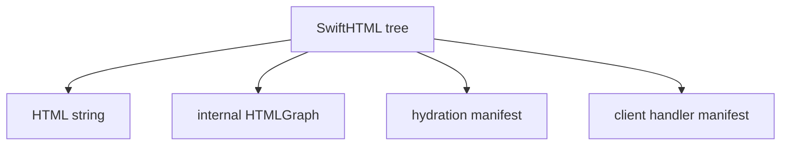

`HTML.render()` can remain as a convenience for static SSR, but SwiftWeb should use the artifact renderer. The raw `HTMLGraph` is an internal representation owned by SwiftHTML; public consumers use artifact facade properties, hydration indexes, DOM snapshots, diagnostics, and patch/runtime contracts.

The hydration manifest records component boundaries and state slots.

SwiftWeb selects render options from the configured client runtime. Build configuration controls developer diagnostics and the dev reload script, but client interactivity is provided by the WASM runtime.

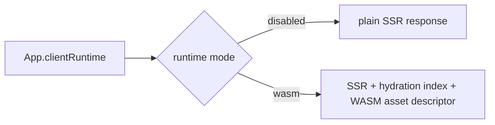

| Runtime mode | Server-side event closures | HTML hydration markers | Injected client descriptor | Availability |
|---|---:|---:|---|---|
| `disabled` | No | No | None | Debug and release |
| `wasm` | No | Yes | WASM manifest path, runtime asset path, hydration index | Debug and release |

Production rendering still validates unsafe element names, unsafe attribute names, and unsafe URL attributes before writing HTML. It does not keep developer diagnostics or server-resident closures in the response rendering artifact.

```swift
public struct HydrationManifest: Sendable {
    public var components: [HydrationComponentRecord]
}

public struct HydrationComponentRecord: Sendable, Equatable {
    public let id: ComponentID
    public let typeName: String
    public let path: String
    public let nodeID: HTMLNodeID
    public let stateSlots: [StateSlotRecord]
    public let environmentReads: [EnvironmentReadRecord]
    public let serverCapabilityReads: [ServerCapabilityReadRecord]
    public let bundleID: ClientBundleID?
    public let loadPolicy: ClientLoadPolicy
    public let serverSlots: [ServerSlotRecord]
    public let environmentSnapshot: ClientEnvironmentSnapshot
}
```

`ComponentID` is derived from component type and render path. `StateSlotID` is derived from `ComponentID` and the source location of the `@State` declaration. Hydration boundary markers are emitted only for client-owned component subtrees so the browser runtime can associate DOM ranges with client records.

Renderer diagnostics report boundary violations such as event handlers outside a `ClientComponent`, `@State` in a server-owned component, and server-only environment reads from client-owned components. SwiftWeb emits these diagnostics to standard error only in `DEBUG` builds while rendering HTML responses, action results, and streamed HTML chunks.

### Hydration Runtime Core

The client runtime has three separable responsibilities: dispatch events, rebuild dirty component output, and apply DOM patches. The Swift implementation exposes this as a testable runtime core before binding it to browser APIs.

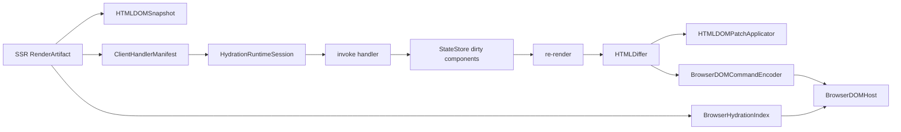

| Type | Responsibility |
|---|---|
| `HTMLDOMSnapshot` | In-memory DOM-equivalent tree used to verify patch semantics |
| `HTMLDOMPatchApplicator` | Applies `HTMLPatch` operations to a snapshot in the same order a browser runtime must apply them |
| `HydrationRuntimeSession` | Owns the current artifact and snapshot, dispatches event handlers, flushes dirty state, diffs, and applies patches |
| `BrowserHydrationIndex` | Serializable graph-to-DOM index used by the host to resolve `HTMLNodeID` targets |
| `BrowserDOMCommandEncoder` | Lowers `HTMLPatch` into wire-safe browser host commands |
| `BrowserHydrationRuntime` | Facade that invokes handlers, flushes updates, and sends command batches to a `BrowserDOMHost` |

This core intentionally does not pretend to be the browser. It fixes the runtime contract that the WASM/browser binding must implement: handler dispatch, state flushing, keyed moves, property updates, and subtree replacement must produce the same HTML as a fresh render.

`HydrationRuntimeSession.flush()` tracks dirty component IDs and preserves them across failed flushes, but the current implementation re-renders the root and performs a graph diff for correctness. Scoped subtree rendering and scoped diffing are performance optimizations for the runtime layer, not requirements for the public SwiftHTML API.

The browser host boundary is command based. WASM owns app logic and diffing; the host binding owns DOM lookup and Web API calls.

| Command | Browser responsibility |
|---|---|
| `updateText` / `updateComment` | Update node text data |
| `updateAttributes` | Replace rendered attributes and event marker attributes |
| `setProperty` | Set live DOM properties such as `value`, `checked`, and `selected` |
| `insertHTML` / `replaceSubtree` | Parse trusted renderer-produced HTML and place it at the indexed DOM location |
| `remove` / `moveKeyed` | Preserve keyed DOM identity while changing order |

`BrowserDOMCommandBatch` is `Codable` so the concrete host binding can use JSON during development and switch to a lower-overhead ABI later without changing the SwiftHTML runtime contract.

Each runtime update also carries the updated `BrowserHydrationIndex`. This matters for commands such as `insertHTML` and `replaceSubtree`: after the host changes the DOM, it must replace its node index with the updated index so future command targets resolve to the new graph.

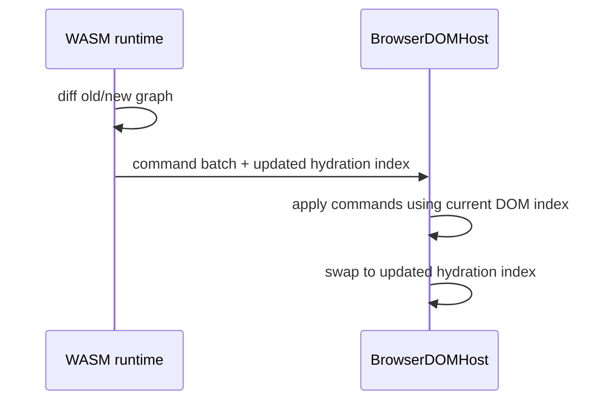

### SwiftWeb Client Runtime

SwiftWeb has one server-side selector for client behavior:

```swift
struct MyApp: SwiftWeb.App {
    var clientRuntime: ClientRuntimeConfiguration {
        .wasm(
            assetPath: "/assets/swift-web-runtime.wasm",
            fileURL: wasmArtifactURL,
            metricsMode: .summary
        )
    }
}
```

The selector is intentionally small. It does not change routing, page matching, or component semantics. It only decides whether the HTML response is plain SSR or WASM hydration.

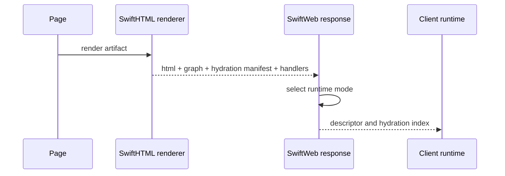

| Mode | Responsibility | What is not allowed |
|---|---|---|
| `disabled` | Serve static SSR HTML | Event closure capture, hydration markers |
| `wasm` | Serve SSR HTML plus the data needed for the client WASM runtime to hydrate | Server-resident client closure invocation |

The descriptor is emitted as inert JSON data:

```html
<script type="application/json" id="swift-web-client-runtime">...</script>
```

That element is not application JavaScript. It is a transport envelope for the hydration index and asset references. The production path is `wasm`; client state, client event closures, diffing, and patch planning belong to the Swift/WASM runtime. The browser host binding may provide narrow Web API access, but it must not contain application state or application action logic.

The production browser path has three layers.

```mermaid
flowchart LR
    A["SSR HTML + hydration index"] --> B["versioned host binding"]
    B --> C["ClientBundleManifest"]
    C --> D["Swift WASM bundle"]
    B -->|DOM event payload| D
    D -->|BrowserDOMCommandBatch| B
    B --> E["Browser DOM"]
```

| Layer | Responsibility |
|---|---|
| SSR response | Emits HTML, hydration markers, inert descriptor JSON, preload links, and the versioned host script URL |
| Host binding | Fetches manifest and WASM assets, supplies WASI imports, routes DOM events to the owning WASM bundle, and calls exported WASM functions |
| Swift WASM runtime | Owns component state, event closures, scoped environment reconstruction, diffing, and command batch creation or direct DOM application through JavaScriptKit |

The host script is served by `SwiftWebWasmRuntimeRoutes.registerHost(on:)` at `/__swiftweb/wasm/runtime-host.js` and injected with a version query such as `/__swiftweb/wasm/runtime-host.js?v=8`. The same registration serves JavaScriptKit's module runtime at `/__swiftweb/wasm/javascript-kit-runtime.js?v=1`. The routes return `Cache-Control: no-cache`; the version query prevents stale failed ES module evaluations from being reused during development.

JavaScriptKit is part of the SwiftWebUIRuntime dependency graph for the browser runtime, not SwiftHTML core. SwiftHTML defines the hydration index, command model, diffing session, state store, and browser host contract. SwiftWebUIRuntime owns the concrete WASM bootstrap bridge, URL query decoding, JavaScriptKit DOM application, and exported ABI entrypoint. The small host binding remains responsible for loading and ABI calls; application state, event semantics, and component behavior stay inside Swift.

When a runtime response sets `appliesDOMCommandsInRuntime` to `true`, the host binding updates the hydration index but does not apply the returned DOM command batch. This prevents duplicate patches when the JavaScriptKit-backed Swift runtime has already mutated the browser DOM.

The WASM bundle currently uses a JSON ABI. The exported functions are:

| Export | Contract |
|---|---|
| `swiftweb_alloc` / `swiftweb_dealloc` | Allocate and free input payload buffers in WASM memory |
| `swiftweb_bootstrap` | Accept `ClientWasmBootstrapRequest`, reconstruct the root component, capture client closures, and publish a fresh hydration index |
| `swiftweb_dispatch_event` | Accept `ClientWasmEventRequest`, invoke the handler, flush state, diff, and publish DOM commands |
| `swiftweb_response_ptr` / `swiftweb_response_len` / `swiftweb_response_free` | Expose the encoded `ClientWasmRuntimeResponse` produced by the last call |

The host binding also mirrors runtime state onto DOM attributes for development and E2E checks:

| Attribute | Meaning |
|---|---|
| `data-swift-web-wasm-ready` | `"true"` after bootstrap and event listener installation |
| `data-swift-web-wasm-phase` | Current phase such as `fetchingManifest`, `instantiatingBundle`, `bootstrapping`, or `ready` |
| `data-swift-web-wasm-loaded` | Comma-separated loaded bundle identifiers |

### WASM Runtime Metrics

SwiftWeb exposes browser-side runtime metrics so JavaScriptKit, split loading, and hydration decisions can be evaluated with the same evidence.

```mermaid
flowchart LR
    A["runtime start"] --> B["manifest fetch"]
    B --> C["JavaScriptKit import"]
    C --> D["WASM bundle fetch"]
    D --> E["compile"]
    E --> F["instantiate"]
    F --> G["bootstrap"]
    G --> H["ready"]
    H --> I["event dispatch"]
```

`SwiftWebWasmClientRuntime.metricsMode` controls how much the host binding measures.

| Mode | Load path | Use |
|---|---|---|
| `.disabled` | No metrics publication | Production runs that do not need browser timing |
| `.summary` | Keeps `WebAssembly.instantiateStreaming` and records combined bundle timing | Default runtime health checks with low overhead |
| `.detailed` | Uses explicit fetch, `WebAssembly.compile`, and instantiate steps | Development evaluation of download, compile, instantiate, and JavaScriptKit import cost |

Metrics recording is memory-first. The host publishes the DOM snapshot only at meaningful boundaries: ready, deferred bundle load, event dispatch, and runtime failure. This keeps `.summary` from adding repeated JSON serialization and DOM mutation to the critical path being measured.

The runtime publishes a JSON snapshot at `window.__swiftWebWasmRuntimeMetrics` and mirrors the same snapshot into the inert JSON element `#swift-web-wasm-runtime-metrics`. E2E tests should prefer the DOM element because it is available to restricted read-only browser evaluation contexts.

| Field | Meaning |
|---|---|
| `summary.readyMs` | Time from runtime start to hydrated ready state |
| `summary.manifestFetchMs` / `summary.manifestBytes` | Manifest request cost |
| `summary.javaScriptKitImportMs` | Time spent importing JavaScriptKit's module runtime |
| `summary.wasmDownloadMs` | WASM bytes download time in detailed mode |
| `summary.wasmCompileMs` | WASM compile time in detailed mode |
| `summary.wasmInstantiateMs` | WASM instantiate time in detailed mode |
| `summary.wasmStreamingInstantiateMs` | Combined streaming instantiate time in summary mode |
| `summary.initialBytes` / `summary.totalWasmBytes` | Initial and total loaded WASM byte counts |
| `summary.eventDispatchCount` / `summary.lastEventDispatchMs` | Client interaction cost after hydration |
| `bundles[]` | Per-bundle asset path, byte length, JavaScriptKit import time, load timings, and start time |
| `events[]` | Ordered phase events for debugging the load sequence |

Key summary values are also mirrored to DOM attributes for E2E checks:

| Attribute | Meaning |
|---|---|
| `data-swift-web-wasm-metrics-mode` | Active metrics mode |
| `data-swift-web-wasm-ready-ms` | Ready time |
| `data-swift-web-wasm-initial-bytes` | Initial loaded WASM bytes |
| `data-swift-web-wasm-total-wasm-bytes` | Total loaded WASM bytes |
| `data-swift-web-wasm-javascript-kit-import-ms` | JavaScriptKit module import time |
| `data-swift-web-wasm-wasm-download-ms` | Download time in detailed mode |
| `data-swift-web-wasm-wasm-compile-ms` | Compile time in detailed mode |
| `data-swift-web-wasm-wasm-instantiate-ms` | Instantiate time in detailed mode |
| `data-swift-web-wasm-wasm-streaming-instantiate-ms` | Streaming instantiate time in summary mode |
| `data-swift-web-wasm-event-dispatch-count` | Number of dispatched client events |

The roadmap demo enables `.detailed` metrics so `/counter` can be used as the baseline evaluation page. Loading the page and clicking the client counter should produce both initial-load metrics and event-dispatch metrics.

Deferred component bundles are bootstrapped before their first event dispatch. The host tracks `bootstrappedBundleIDs`; when a component event resolves to a newly loaded bundle, the host calls that bundle's `swiftweb_bootstrap` with the current hydration index and location before invoking `swiftweb_dispatch_event`.

### Roadmap Demo E2E

The `/counter` E2E path must exercise the real WASM runtime loaded from the generated client artifact.

| Step | Check |
|---|---|
| Build WASM | `SWIFTWEB_WASM_BUILD=1 swift build --package-path Examples/CounterApp --product counter-wasm-runtime --swift-sdk swift-6.3.1-RELEASE_wasm -c release` |
| Run app | From `Examples/CounterApp`, run `swift-web dev` or the Xcode `CounterApp` scheme |
| Load server state | Open `http://127.0.0.1:3000/counter`; the server value is actor state, not URL query state |
| Client Counter | Click Increment and Decrement; the client value changes without a page reload |
| Server Counter | Click Increment and Decrement; the button invokes the generated `ActionReference`, mutates `CounterService`, and returns `ActionResult.invalidate(.page)` |
| Invalidation | The client runtime fetches the current page, preserves ClientComponent DOM, and merges the server-owned counter DOM |
| Runtime mode | Page source includes `/__swiftweb/wasm/runtime-host.js` and the document reports `data-swift-web-wasm-ready="true"` |
| JavaScriptKit runtime | `/__swiftweb/wasm/javascript-kit-runtime.js?v=1` returns the JavaScriptKit `SwiftRuntime` module used to provide WASM imports |

`swift-web dev` starts the Vapor target with development reload environment variables. Each restart receives a fresh reload token. HTML responses include the token header and a dev-only reload script. The browser waits on `/__swiftweb/dev/reload` with a long-running fetch; when a rebuild starts a new server token, the wait completes and the browser reloads the current page. This is full-page auto reload, not state-preserving HMR.

### Development Runtime Contract

The development runtime is shared by the CLI and generated Xcode launcher. Generated apps should not implement their own watch loop, process cleanup, or reload endpoint.

```mermaid
flowchart LR
    A["CLI or Xcode launcher"] --> B["SwiftWebDevRuntime"]
    B --> C["build server product"]
    C --> D["launch child server"]
    D --> E["Vapor AppRunner"]
    B --> F["FSEvents"]
    F --> G["restart on save"]
    D --> H["SWIFT_WEB_DEV_PARENT_PID"]
    H --> I["child exits when parent disappears"]
    E --> J["long-poll reload endpoint"]
```

| Contract | Requirement |
|---|---|
| Port | Defaults to `127.0.0.1:3000`; fail clearly if occupied. |
| Watch | Use macOS FSEvents for the app package and local `.package(path:)` dependencies. |
| Rebuild | Run `swift build --product <server>` before each child launch. |
| Reload | Use a token-based long-poll endpoint for full-page reload after restart. |
| Cleanup | Pass `SWIFT_WEB_DEV_PARENT_PID` and terminate the child when the parent disappears. |
| Logs | Emit startup, ready, reload, child-exit, and shutdown through `swift-log`. |

### Split WASM Loading

SwiftWeb must not assume a single application-sized WASM file. The split-loading contract is represented by `ClientBundleManifest`, which is produced from the hydration manifest and a build-time symbol dependency graph.

```mermaid
flowchart TD
    A["HydrationManifest"] --> C["ClientBundlePlanner"]
    B["ClientSymbolGraph"] --> C
    C --> D["ClientBundleManifest"]
    D --> E["runtime chunk"]
    D --> F["shared chunk"]
    D --> G["route chunk"]
    D --> H["component chunks"]
```

`ClientBundlePlanner` uses these steps:

| Step | Rule |
|---|---|
| Build symbol graph | Treat component body, event handlers, state access, observable access, and helper functions as symbols |
| Collapse SCCs | Strongly connected symbols are indivisible and must stay in one bundle |
| Compute closures | Each `ClientComponent` owns the transitive closure of its entry symbols |
| Extract runtime | Runtime symbols form the scheduler / patcher / loader chunk |
| Extract shared | Symbols used by multiple components become shared chunk symbols |
| Route cluster | Eager components contribute non-shared symbols to the initial route chunk |
| Component chunks | Non-eager components keep their remaining symbols in policy-specific component chunks |
| Attach slots | Server slots are carried as opaque DOM ranges and are never rebuilt by client WASM |

```swift
public struct ClientBundleManifest: Sendable, Codable, Equatable {
    public let runtimeBundleID: ClientBundleID?
    public let bundles: [ClientBundleRecord]
    public let components: [ClientComponentAsset]
    public let serverSlots: [ServerSlotRecord]
}
```

At runtime the host binding treats the manifest as authoritative. Initial page startup loads `runtimeBundleID` and eager component bundles, computes dependency closure order, instantiates each missing bundle exactly once, and marks failed loads retryable by clearing the in-flight promise. Component events ask the manifest for the owning component bundle before dispatching the event into WASM.

```mermaid
sequenceDiagram
    participant H as Host binding
    participant M as Manifest
    participant W as WASM bundle
    H->>M: fetch /assets/swift-web-client.json
    H->>H: dependency closure for runtime + eager bundles
    H->>W: fetch + instantiateStreaming
    H->>W: swiftweb_bootstrap
    H->>H: install delegated DOM listeners
    H->>W: swiftweb_dispatch_event
    W-->>H: DOM command batch + hydration index
```

The current demo uses one eager runtime bundle because the counter route only has one client component. The loader contract is bundle-aware and dependency-aware; build-time production splitting still needs a compiler/build integration that emits multiple Swift WASM assets from the symbol graph. Until that exists, the framework must not claim symbol-level Swift chunk splitting. It can validate the manifest planning, route asset serving, dependency loading algorithm, WASM ABI, and browser event-to-WASM path.

`ClientLoadPolicy` controls when a component chunk becomes eligible for download.

| Policy | Meaning |
|---|---|
| `eager` | Required for initial route interactivity |
| `visible` | Load when the boundary approaches the viewport |
| `interaction` | Load on pointer, focus, touch, or equivalent intent |
| `idle` | Load after initial render during idle time |
| `manual` | Runtime or application code explicitly requests the chunk |

`ClientBundleLoadResolver` turns the manifest into concrete loading plans.

```mermaid
flowchart LR
    A["ClientBundleManifest"] --> B["ClientBundleLoadResolver"]
    B --> C["complete dependency plan"]
    B --> D["incremental staged plan"]
    C --> E["single event / retry safe"]
    D --> F["normal route loading"]
```

| API | Contract |
|---|---|
| `initialPlan()` | Loads eager route bundles; if every component is deferred, keeps only the runtime bootstrap eligible |
| `plan(for: ClientLoadPolicy)` | Returns a complete dependency closure for that policy |
| `plan(for: ComponentID)` | Returns a complete dependency closure for a single component |
| `stagedPlans()` | Returns complete closures for every load policy in priority order |
| `incrementalStagedPlans()` | Returns automatic staged plans with bundles already loaded by earlier stages removed; `manual` is excluded |
| `incrementalStagedPlans(includeManual: true)` | Returns the same differential shape including `manual` for tooling or explicit runtime scheduling |

The complete dependency plans are useful when a user interaction asks for a chunk before prior stages finished. The incremental staged plans are the default shape for route startup because they avoid scheduling the same runtime or shared WASM chunk more than once.

`ClientBundleLoadingRuntime` is the stateful execution layer above the resolver.

```mermaid
flowchart LR
    A["ClientBundleLoadResolver"] --> B["complete load plan"]
    B --> C["ClientBundleLoadingRuntime"]
    C --> D["pending"]
    C --> E["loading"]
    C --> F["loaded"]
    C --> G["failed / retryable"]
```

| Runtime API | Contract |
|---|---|
| `scheduleInitial()` | Schedules the eager route closure while skipping bundles already loading or loaded |
| `schedule(loadPolicy:)` | Schedules a policy closure, including dependencies, for viewport / interaction / idle / manual triggers |
| `schedule(componentID:)` | Schedules one component closure so interaction can lead route startup safely |
| `scheduleAutomaticStages()` | Schedules eager, visible, interaction, and idle stages; `manual` stays explicit |
| `complete(_:)` | Marks scheduled bundles loaded after fetch / instantiate succeeds |
| `fail(_:)` | Marks a bundle retryable after fetch / instantiate failure |

Large split-loading checks are manual-only. They are compiled but immediately return unless explicitly enabled.

```bash
xcodebuild test \
  -scheme swift-web-Package \
  -destination 'platform=macOS' \
  -only-testing:SwiftHTMLTests/SwiftHTMLClientBundleLoadingBenchmarkTests \
  'OTHER_SWIFT_FLAGS=$(inherited) -DSWIFTHTML_ENABLE_LOADING_BENCHMARKS'
```

Server slots make layered server/client trees safe for client diffing.

```mermaid
flowchart TD
    A["ClientComponent A"] --> B["ServerSlot S"]
    B --> C["ClientComponent B"]
    A --> D["bundle A"]
    C --> E["bundle B"]
    B --> F["opaque DOM range"]
```

When the client rebuilds `ClientComponent A`, `ServerSlot S` is matched by `ServerSlotID` and skipped by the diff. A nested `ClientComponent B` inside the server slot remains its own hydration boundary and can load a separate bundle.

### Hydration Diagnostics

Hydration diagnostics are structured records, not only log text. Tests and dev tooling should inspect `RenderDiagnostic.code` and `RenderDiagnostic.severity`.

```mermaid
flowchart LR
    A["renderArtifact"] --> B["HTML"]
    A --> C["hydration manifest"]
    A --> D["diagnostics"]
    D --> E["SwiftWeb DEBUG stderr"]
    D --> F["test assertions"]
    D --> G["validateHydration"]
```

| Code | Severity | Meaning | Fix |
|---|---|---|---|
| `swift-html.hydration.state-outside-client-component` | error | `@State` is used in server-owned rendering | Move the state into a `ClientComponent` boundary |
| `swift-html.hydration.event-handler-outside-client-component` | error | DOM event closure is registered outside a client-owned component | Make the owning component a `ClientComponent` |
| `swift-html.hydration.server-only-environment-in-client-component` | error | Client-owned component reads server-only environment | Use `ClientEnvironmentKey`, pass a client-safe prop, or keep the read on the server |
| `swift-html.hydration.server-capability-in-client-component` | error | Client-owned component reads `@Server` capability | Move the read to `ServerComponent`, page `load`, route handler, or server action |
| `swift-html.hydration.runtime-only-environment-in-client-component` | warning | Client-owned component reads runtime-only type environment | Ensure the browser runtime provides the value or replace it with a snapshotted key/prop |
| `swift-html.identity.duplicate-key-in-for-each` | error | `ForEach` has duplicate keys | Use a unique stable semantic key for every row |

`RenderArtifact.validateHydration()` throws `RenderDiagnosticError` when error-level diagnostics exist. Unit tests should call it for pages/components that are expected to hydrate cleanly.

## Streaming SSR

Streaming SSR must keep the same model.

| Streamed output | Requirement |
|---|---|
| HTML chunks | Safe incremental HTML output |
| Interactive chunks | Handler IDs must be registered before or with the chunk |
| Suspense-like sections | Stable placeholder and replacement target |
| State boundaries | Component identity must remain stable across chunks |

The streaming renderer should emit HTML and client manifest updates together.

## Security

SwiftHTML must keep user-authored JavaScript out of the public API.

| Rule | Reason |
|---|---|
| Event closures lower to WASM handlers | Avoid inline script and unsafe string code |
| HTML carries handler IDs only | Compatible with strict CSP |
| Attribute values are escaped by default | Prevent markup injection |
| Raw HTML is explicit | Make unsafe rendering visible |
| Server-only values stay out of WASM | Prevent secret leakage |

## Target Syntax

The desired syntax is React-like in structure but Swift-native in typing.

```swift
struct ProfileForm: Component {
    @State private var name = ""

    var body: some HTML {
        div(.class("profile-form")) {
            label(.`for`("name")) {
                "Name"
            }

            input(
                .id("name"),
                .name("name"),
                .value($name),
                .onInput { event in
                    name = event.value ?? ""
                }
            )

            button(.type(.button), .onClick {
                name = ""
            }) {
                "Clear"
            }
        }
    }
}
```

Custom components remain UpperCamelCase.

```swift
VStack(spacing: .medium) {
    ProfileForm()
    Card {
        "Details"
    }
}
```

## Implementation Direction

The current implementation should stay aligned with the typed DSL contract and avoid compatibility shims while the API is still early.

Implementation files are grouped by responsibility. Public API should remain discoverable from these boundaries rather than from large mixed files.

```text
Sources/SwiftHTML
├── Core
│   ├── Context.swift
│   ├── Environment.swift
│   ├── EnvironmentSnapshot.swift
│   ├── EnvironmentModifier.swift
│   ├── Bindable.swift
│   ├── HTML.swift
│   ├── RuntimeValueBox.swift
│   └── State.swift
├── Builder
│   ├── Group.swift
│   ├── HTMLBuilder.swift
│   ├── TupleComponent.swift
│   ├── OptionalComponent.swift
│   ├── ConditionalComponent.swift
│   ├── ArrayComponent.swift
│   └── ForEach.swift
├── Elements
│   ├── Element.swift
│   ├── HTMLAttribute.swift
│   └── Tags.swift
├── Graph
│   ├── HTMLGraph.swift
│   └── HTMLDiff.swift
└── Rendering
    ├── HTMLRenderer.swift
    └── HTMLWriter.swift
```

| Area | Direction |
|---|---|
| Tags | Lowercase tag structs |
| Builder | `TupleComponent` and explicit control-flow components |
| Attributes | Typed attributes plus a raw future-proof escape hatch |
| Events | Typed event attributes that capture client closures |
| Renderer | Artifact renderer with HTML, internal graph, and manifests |
| Component | Treat as hydration and state boundary |
| State | Make identity stable and component-scoped |
| Runtime | Keep JavaScript bridge internal and expose WASM dispatch as the contract |
